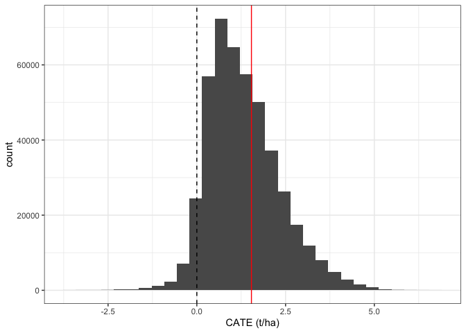
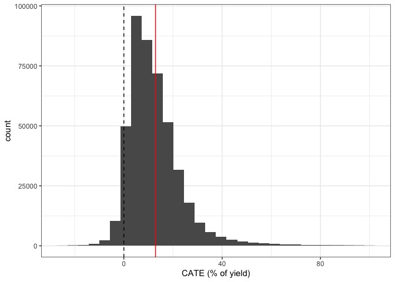

  
Goal: Sensitivity analysis (for field size) for maize yield impact evaluation. This replicates the maize causal forest analysis based on an independent field sample using a field size threshold of 39 pixels

* input master data file available in associated Zenodo repo
* intermediate causal forest objects available in associated Zenodo repo


**R Packages Needed**
  

``` r
library(tidyverse)
library(grf)
library(earth)
library(corrplot)
library(RColorBrewer)

library(here)
sessionInfo()
```

```
## R version 4.5.2 (2025-10-31)
## Platform: aarch64-apple-darwin20
## Running under: macOS Sequoia 15.7.4
## 
## Matrix products: default
## BLAS:   /System/Library/Frameworks/Accelerate.framework/Versions/A/Frameworks/vecLib.framework/Versions/A/libBLAS.dylib 
## LAPACK: /Library/Frameworks/R.framework/Versions/4.5-arm64/Resources/lib/libRlapack.dylib;  LAPACK version 3.12.1
## 
## locale:
## [1] en_US.UTF-8/en_US.UTF-8/en_US.UTF-8/C/en_US.UTF-8/en_US.UTF-8
## 
## time zone: America/Los_Angeles
## tzcode source: internal
## 
## attached base packages:
## [1] stats     graphics  grDevices utils     datasets  methods   base     
## 
## other attached packages:
##  [1] here_1.0.2         RColorBrewer_1.1-3 corrplot_0.95      earth_5.3.5       
##  [5] plotmo_3.7.0       plotrix_3.8-14     Formula_1.2-5      grf_2.6.1         
##  [9] lubridate_1.9.5    forcats_1.0.1      stringr_1.6.0      dplyr_1.2.0       
## [13] purrr_1.2.1        readr_2.2.0        tidyr_1.3.2        tibble_3.3.1      
## [17] ggplot2_4.0.2      tidyverse_2.0.0   
## 
## loaded via a namespace (and not attached):
##  [1] sass_0.4.10       generics_0.1.4    stringi_1.8.7     lattice_0.22-7   
##  [5] hms_1.1.4         digest_0.6.39     magrittr_2.0.4    evaluate_1.0.5   
##  [9] grid_4.5.2        timechange_0.4.0  fastmap_1.2.0     rprojroot_2.1.1  
## [13] jsonlite_2.0.0    Matrix_1.7-4      scales_1.4.0      jquerylib_0.1.4  
## [17] cli_3.6.5         rlang_1.1.7       withr_3.0.2       cachem_1.1.0     
## [21] yaml_2.3.12       tools_4.5.2       tzdb_0.5.0        vctrs_0.7.1      
## [25] R6_2.6.1          lifecycle_1.0.5   pkgconfig_2.0.3   pillar_1.11.1    
## [29] bslib_0.10.0      gtable_0.3.6      glue_1.8.0        Rcpp_1.1.1       
## [33] xfun_0.56         tidyselect_1.2.1  rstudioapi_0.18.0 knitr_1.51       
## [37] farver_2.1.2      htmltools_0.5.9   rmarkdown_2.30    compiler_4.5.2   
## [41] S7_0.2.1
```


*Directories*
  

``` r
repoDir <- here::here()

# master data
dataDir <- '/Users/dein121/local/data_nonRepo/2025_irrigationAndYields/final_data_repo'

dataName <- 'pointSample_combined_fewerCDL_test39px_20260123.rds'

# scratch folder for model rdata objects
scratchFolder <- paste0(dataDir,'/causal_forest_objects/maize_39px')

# make scratch folder if necessary
dir.create(file.path(scratchFolder), showWarnings = FALSE)
```


# Load and filter
Clean master data by:

* maize only
* remove spurious classifications (eg, annual status differs from overarching irrigation type)
* clean extreme yield values


``` r
# load data, extract corn
master <- readRDS(paste0(dataDir,'/',dataName)) %>%
  # drop columns relating to climate projections
  dplyr::select(-c(contains('vpd_summ')))


maize <- master %>% 
  filter(cdl_class == 'Corn',
         !is.na(yield_tha_corn))
nrow(maize)
```

```
## [1] 961052
```

``` r
# assign treatment variable, W (1 = irrigated that year, 0 is not)
maize2 <- maize %>%
  mutate(W = case_when(lanid_status == 1 ~ 1,
                       is.na(lanid_status) ~ 0))

# check status distribution
table(maize2$irr_type, maize2$W)
```

```
##                  
##                        0      1
##   existing         23113  85497
##   never - counter 311161      0
##   never - random  194528     52
##   new             191360 155341
```

``` r
# remove likely bad single-year classifications
maize3 <- maize2 %>%
  filter(!(irr_type == 'never - random' & W == 1),
         !(irr_type == 'existing' & W == 0),
         !(irr_type == 'new' & W == 0)) # probably prior to adoption but still 

# check status distribution
table(maize3$irr_type, maize3$W)
```

```
##                  
##                        0      1
##   existing             0  85497
##   never - counter 311161      0
##   never - random  194528      0
##   new                  0 155341
```

``` r
# filter for yield data and remove extreme yield values
cleanQ <- quantile(maize3$yield_tha_corn, probs = c(0.0001, 0.9999), na.rm=TRUE)
cleanQ   
```

```
##     0.01%    99.99% 
##  0.173263 20.688214
```

``` r
maize4 <- maize3 %>%
  filter(yield_tha_corn > cleanQ[1]) %>%
  filter(yield_tha_corn < cleanQ[2]) %>%
  mutate(uniqueID = row_number()) %>%
  dplyr::rename(., Y = yield_tha_corn)          # set outcome variable

# breakdown of treatment/control
table(maize4$W)
```

```
## 
##      0      1 
## 505565 240812
```

``` r
table(maize4$year)
```

```
## 
##  1999  2000  2001  2002  2003  2004  2005  2006  2007  2008  2009  2010  2011 
##  6513 15966 15801 15716 21660 21557 21662 31945 44925 48848 47942 54065 56431 
##  2012  2013  2014  2015  2016  2017 
## 48820 59994 57904 60103 59387 57138
```

``` r
table(maize4$W, maize4$year)
```

```
##    
##      1999  2000  2001  2002  2003  2004  2005  2006  2007  2008  2009  2010
##   0  5264 13624 13080 12803 16578 16219 16412 23866 31949 33801 32658 35604
##   1  1249  2342  2721  2913  5082  5338  5250  8079 12976 15047 15284 18461
##    
##      2011  2012  2013  2014  2015  2016  2017
##   0 36792 33282 37491 36281 37127 36620 36114
##   1 19639 15538 22503 21623 22976 22767 21024
```

# Causal Forest

## Propensity model


``` r
X_norm <- maize4 %>%
  dplyr::select(c(contains('norm'), contains('dist'), 'wtd_zell',
                  "nccpicorn",'drclasscd',
                  'clay','sand','silt',
                  'rootznaws', 'slope','bulkDensityt','ksat','pH')) %>%
  dplyr::select(-c(dist_toIrr))

names(X_norm)

W <- maize4 %>% dplyr::pull(W)

W_forest <- grf::regression_forest(X_norm, W, num.trees = 2000)

W_hat <- predict(W_forest)$predictions

WvarImp <- W_forest %>% 
  grf::variable_importance() %>% 
  as.data.frame() %>% 
  mutate(variable = colnames(W_forest$X.orig)) %>% 
  arrange(desc(V1))

# save intermediates
saveRDS(maize4, paste0(scratchFolder, '/maize.rds'))
saveRDS(W_forest, paste0(scratchFolder, '/W_forest.rds'))
saveRDS(W_hat, paste0(scratchFolder, '/W_hat.rds'))
saveRDS(WvarImp, paste0(scratchFolder, '/W_forest_varImp.rds'))
```

## Prune samples

toss out rows with excessively high/low propensities


``` r
W <- maize4 %>% dplyr::pull(W)

W_hat <- readRDS(paste0(scratchFolder, '/W_hat.rds'))
WvarImp <- readRDS(paste0(scratchFolder, '/W_forest_varImp.rds'))
WvarImp

# check propensity scores
p_rf = W_hat
hist(p_rf, xlab = 'Propensity Scores', main = 'Histogram of Propensity Scores')

sum(p_rf < .05)
sum(p_rf > .95)

{plot(smooth.spline(p_rf, W, df = 4))
abline(0, 1)}

# filter it
overlap0 <- maize4 %>%
  mutate(w_hat = W_hat) %>%
  mutate(keep = case_when(w_hat < 0.02 | w_hat > 0.98 ~ 0,
                        w_hat >= 0.02 | w_hat <= 0.98  ~ 1))

overlap <- overlap0 %>% filter(keep == 1)

nrow(overlap0) - nrow(overlap)

nrow(overlap)

both <- data.frame(W_hat = W_hat,
                   type = paste0('original sample (',nrow(maize4), ' obs)')) %>%
  bind_rows(data.frame(W_hat = overlap$w_hat,
                       type = paste0('Propensity Filtered (', nrow(overlap), ' obs)')))

ggplot(both,
       aes(x = W_hat)) +
  geom_histogram() +
  geom_vline(xintercept = 0.02, col='red') +
  geom_vline(xintercept = 0.98, col = 'red') +
  facet_wrap(~type, nrow = 2) +
  #ggeasy::easy_center_title() +
  ggtitle('Maize') +
  theme_bw()


table(overlap$W)

table(overlap$year)

table(overlap[,c('state')])

table(overlap[,c('state',"W")])

# save overlap data!
saveRDS(overlap, paste0(scratchFolder, '/overlap.rds'))
```

## Expected Outcome: yhat

### pick covars

Here, removes gldas variables (redundant with tc soilm) and tc_def (redundant with vpd)


``` r
overlap <- readRDS(paste0(scratchFolder, '/overlap.rds'))

# subset of variables to choose from
X_c1 <- overlap %>%
  dplyr::select(-c (W,  geom_id, fips5, w_hat, keep, cdl_class,contains('norm'),
                    latitude, longitude, mukey, state_fips, irr_type, uniqueID, 
                    state_name, state,  nccpisoy, yield_tha_soy, lanid_status,
                    adoptionYear, contains('dist'), elevation, ted, 
                    lastYearIrr, contains('condon'),
                    contains('gldas'), contains('tc_def'))) %>%
  tidyr::drop_na()

# mars for var dplyr::selection
set.seed(5)
marsAll <- earth::earth(Y ~ ., data = X_c1, degree = 2)

summary(marsAll)
ev <- evimp(marsAll) # estimate variable importance
ev

saveRDS(marsAll, paste0(scratchFolder, '/mars_c1.rds'))
```

### Train Yhat


``` r
overlap <- readRDS(paste0(scratchFolder, '/overlap.rds'))

# variables from mars
marsAll <- readRDS(paste0(scratchFolder, '/mars_c1.rds'))
summary(marsAll)
ev <- evimp(marsAll) # estimate variable importance
ev

varsToKeep = rownames(ev)
X <- overlap %>%
  dplyr::select(all_of(varsToKeep)) 

Y <- overlap %>% dplyr::pull(Y)
Y_forest <- grf::regression_forest(X, Y, num.trees = 2000)

YvarImp <- Y_forest %>% 
  grf::variable_importance() %>% 
  as.data.frame() %>% 
  mutate(variable = colnames(Y_forest$X.orig)) %>% 
  arrange(desc(V1))
YvarImp

Y_hat <- predict(Y_forest)$predictions

saveRDS(Y_hat, paste0(scratchFolder, '/Y_hat.rds'))
saveRDS(Y_forest, paste0(scratchFolder, '/Y_forest.rds'))
saveRDS(YvarImp, paste0(scratchFolder, '/Y_forest_varImp.rds'))
```

### evaluate outcome model


``` r
overlap <- readRDS(paste0(scratchFolder, '/overlap.rds'))
Y_hat <- readRDS(paste0(scratchFolder, '/Y_hat.rds'))
YvarImp <- readRDS(paste0(scratchFolder, '/Y_forest_varImp.rds'))
YvarImp

Y <- overlap %>% dplyr::pull(Y)

### Outcome Estimation Y_Hat
Ychecker <- data.frame(Y = Y,
                       Y_hat = Y_hat,
                       year = overlap$year)
Yagreement <- lm(Y~Y_hat)
summary(Yagreement)

# yield year by year
YcheckerLong <- Ychecker %>%
  tidyr::gather(., key = variable, value = value, Y:Y_hat)

ggplot(YcheckerLong, aes(x=as.factor(year), y = value, group = interaction(year,variable), 
                         fill = variable)) +
  geom_boxplot() +
  theme_bw() +
  ylab('Yield (t/ha)') +
  xlab('Year')

ggplot(Ychecker, aes(x=Y, y = Y_hat)) +
  geom_hex() +
  scale_fill_gradientn(colors = brewer.pal(9,'YlGnBu')) +
  geom_smooth(method= 'lm') +
 # coord_equal(xlim=c(1,3), ylim=c(1,3)) + 
  geom_abline(slope = 1, intercept = 0, linetype='dashed') + 
  facet_wrap(~year) +
  theme_bw()
```

## causal forest


``` r
# reload overlap
overlap <- readRDS(paste0(scratchFolder, '/overlap.rds'))
Y_hat <- readRDS(paste0(scratchFolder, '/Y_hat.rds'))

# reload mars variables
marsAll <- readRDS(paste0(scratchFolder, '/mars_c1.rds'))
ev <- evimp(marsAll) # estimate variable importance
envvars <- rownames(ev)

# treatment
W <- overlap %>% dplyr::pull(W)
w_hat <- overlap$w_hat
#WvarImp

# outcome
Y <- overlap %>% dplyr::pull(Y)

# make covariate list; 
# add in important propensity variables not already present
varsToKeep_main = c(envvars, 'wtd_zell' )


Xmain <- overlap %>%
  dplyr::select(all_of(varsToKeep_main) )

cf <- grf::causal_forest(Xmain, Y, W, Y_hat, w_hat, num.trees = 2000)

varImpMain <- cf %>% 
  variable_importance() %>% 
  as.data.frame() %>% 
  mutate(variable = colnames(cf$X.orig)) %>% 
  arrange(desc(V1))
varImpMain

saveRDS(cf, paste0(scratchFolder, '/cf_clusters_xc1.rds'))
saveRDS(varImpMain, paste0(scratchFolder, '/cf_clusters_xc1_varImp.rds'))
```


# Checking things out

reload and extract model outputs


``` r
# data used
overlap <- readRDS(paste0(scratchFolder, '/overlap.rds'))

# propensity model results
W_hat <- overlap %>% dplyr::pull(w_hat)
WvarImp <- readRDS(paste0(scratchFolder, '/W_forest_varImp.rds'))
W_hat_all <- readRDS(paste0(scratchFolder, '/W_hat.rds'))

# outcome model
Y_hat <- readRDS(paste0(scratchFolder, '/Y_hat.rds'))
YvarImp <- readRDS(paste0(scratchFolder, '/Y_forest_varImp.rds'))

# causal forest
cf <- readRDS(paste0(scratchFolder, '/cf_clusters_xc1.rds'))
varImp <- readRDS(paste0(scratchFolder, '/cf_clusters_xc1_varImp.rds'))

# reconstruct subsets
X_norm <- maize4 %>%
  dplyr::select(c(contains('norm'), contains('dist'), contains('wtd'),
                  "nccpicorn",'drclasscd',
                  'clay','sand','silt',
                  'rootznaws', 'slope','bulkDensityt','ksat','pH')) %>%
  dplyr::select(-c(dist_toIrr))

W <- overlap %>% dplyr::pull(W)
Y <- overlap %>% dplyr::pull(Y)

# process results ------------------------------
# add predicted treatment effects to data 
constOob_predict <- predict(cf)

# add hats to original data frame
overlapW0 <- overlap %>%
  bind_cols(data.frame(Y_hat = Y_hat))

colNormals <- names(X_norm)

colVars <- varImp %>% dplyr::pull(variable)

overlapW <- overlapW0 %>%
  mutate_at(colNormals, list(Q4n = ~ntile(., 4),
                             Q5n = ~ntile(., 5))) %>%
  mutate_at(colVars, list(Q4 = ~ntile(., 4),
                          Q5 = ~ntile(., 5)))

overlapTau <- overlapW %>%
  bind_cols(constOob_predict) 
```


## Propensity by covariates


``` r
# add hats to original data frame
prop_all <- maize4 %>%
  bind_cols(data.frame(W_hat = W_hat_all))

# calculate quantiles of interest
colNormals <- names(X_norm)
colVars <- varImp %>% dplyr::pull(variable)

prop_all2 <- prop_all %>%
  mutate_at(WvarImp$variable, list(Q4n = ~ntile(., 4),
                           Q5n = ~ntile(., 5))) %>%
  mutate_at(colVars, list(Q4 = ~ntile(., 4),
                           Q5 = ~ntile(., 5)))

# plot normals vs What : quantiles
propensityVarsLong2 <- prop_all2 %>%
  dplyr::select(c(W_hat, contains('Q4n'))) %>%
  tidyr::gather(., key = variable, value = value, ksat_Q4n:bulkDensityt_Q4n) 

ggplot(propensityVarsLong2,
       aes(y = W_hat, x = value, group = value)) +
  geom_boxplot() +
  facet_wrap(~variable) +
  theme_bw() + xlab('Quartile') + ylab('W.hat = conditional prob of treatment')
```

### propensity fewer


``` r
WvarImp

vars3 <- c('ksat','rootznaws','wtd_zell',
                         'vpd_jul_norm_hPa', 'sand','slope',
                         'clay','silt',
                         'pr_jul_norm_mm')
vars3_q4 <- paste0(vars3, '_Q4n')
propensity2 <- propensityVarsLong2 %>% 
  dplyr::filter(variable %in% vars3_q4)


ggplot(propensity2,
       aes(y = W_hat, x = value, group = value)) +
  geom_boxplot() +
  facet_wrap(~variable, scales = 'free_x') +
  theme_bw() +# xlab('Qaurtile') +
  ylab('W.hat = conditional prob of treatment')
```

# more


## Average treatment Effects


``` r
varImp
```

```
##              V1     variable
## 1  0.6539902439         silt
## 2  0.0872786585 bulkDensityt
## 3  0.0658844512         year
## 4  0.0507652439    nccpicorn
## 5  0.0497335366         ksat
## 6  0.0407045732    rootznaws
## 7  0.0101774390     tmin_apr
## 8  0.0066408537      ppt_jun
## 9  0.0064673780     tmax_apr
## 10 0.0032871951    drclasscd
## 11 0.0031597561      aridity
## 12 0.0031564024      vpd_jun
## 13 0.0028902439       GDD_ss
## 14 0.0027097561     tmax_jun
## 15 0.0022094512     wtd_zell
## 16 0.0018798780 meanTemp_may
## 17 0.0015707317     pr_early
## 18 0.0014807927      ppt_may
## 19 0.0013807927     tmin_jul
## 20 0.0013469512 rtz_jun_mean
## 21 0.0011045732     vpd_july
## 22 0.0007731707      Augmaxt
## 23 0.0007713415 tc_soilm_jun
## 24 0.0006365854     tmax_jul
```

``` r
ate_cf_aipw = average_treatment_effect(cf, target.sample = 'overlap')

tauhat_rf_aipw = c(ATE=ate_cf_aipw["estimate"],
                   lower_ci=ate_cf_aipw["estimate"] - 1.96 * ate_cf_aipw["std.err"],
                   upper_ci=ate_cf_aipw["estimate"] + 1.96 * ate_cf_aipw["std.err"])

tauhat_rf_aipw
```

```
##      ATE.estimate lower_ci.estimate upper_ci.estimate 
##          1.538105          1.508971          1.567239
```

``` r
ggplot(overlapTau,
       aes(x = predictions)) +
  geom_histogram() +
  xlab('CATE (t/ha)') +
  geom_vline(xintercept = 0, col = 'black', linetype = 'dashed') +
  geom_vline(xintercept = ate_cf_aipw["estimate"], col = 'red') +
  theme_bw()
```

```
## `stat_bin()` using `bins = 30`. Pick better value `binwidth`.
```

<!-- -->

``` r
summary(overlapTau$Y)
```

```
##    Min. 1st Qu.  Median    Mean 3rd Qu.    Max. 
##   0.175   9.920  11.490  11.333  12.965  20.610
```

``` r
summary(overlapTau$predictions)
```

```
##    Min. 1st Qu.  Median    Mean 3rd Qu.    Max. 
## -3.5877  0.5986  1.1815  1.3261  1.9178  6.7279
```

``` r
quantile(overlapTau$predictions, c(.1, .5, .9)) 
```

```
##       10%       50%       90% 
## 0.2181769 1.1815212 2.6858026
```

### ATE as percent


``` r
# distribution of ATE
summary(overlapTau$predictions)
```

```
##    Min. 1st Qu.  Median    Mean 3rd Qu.    Max. 
## -3.5877  0.5986  1.1815  1.3261  1.9178  6.7279
```

``` r
# ate as a percent of mean  yield
ate_cf_aipw["estimate"]/mean(overlapTau$Y) *100
```

```
## estimate 
## 13.57133
```

``` r
# ate as the median/mean of the percent increase for each sample point
percentCheck <- overlapTau %>%
  mutate(yield_diff_perc = predictions/Y * 100)

summary(percentCheck$yield_diff_perc)
```

```
##     Min.  1st Qu.   Median     Mean  3rd Qu.     Max. 
## -142.462    5.241   10.500   12.874   17.343 2148.964
```

``` r
quantile(percentCheck$yield_diff_perc, c(.1, .5, .9)) 
```

```
##       10%       50%       90% 
##  1.899618 10.500467 25.178776
```

``` r
meanATEp <- mean(percentCheck$yield_diff_perc)
meanATEp
```

```
## [1] 12.87404
```

``` r
ggplot(percentCheck %>% filter(yield_diff_perc < 100 & yield_diff_perc > -25),
       aes(x = yield_diff_perc)) +
  geom_histogram() +
  xlab('CATE (% of yield)') +
  geom_vline(xintercept = 0, col = 'black', linetype = 'dashed') +
  geom_vline(xintercept = meanATEp, col = 'red') +
  theme_bw()
```

```
## `stat_bin()` using `bins = 30`. Pick better value `binwidth`.
```

<!-- -->

``` r
# save df for official figures
dataOut <- percentCheck %>%
  dplyr::select(c(geom_id, uniqueID, irr_type, fips5, adoptionYear,
                  state_name, year, cdl_class, Y, W, 
                  w_hat, Y_hat,
                  predictions, yield_diff_perc,
                  all_of(YvarImp$variable),
                  all_of(WvarImp$variable)))

#write_csv(dataOut, paste0(dirOut,'/', dfOut))
```


