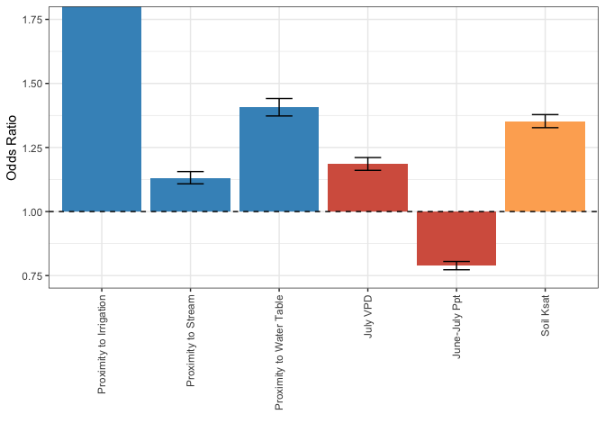

  
Goal: Assess factors that might predict irrigation installation

Notes:

* creates Figure 4
* input master data file available in associated Zenodo repo


**R Packages Needed**
  

``` r
library(tidyverse)
library(RColorBrewer)
library(ggforce)

library(here)
sessionInfo()
```

```
## R version 4.5.2 (2025-10-31)
## Platform: aarch64-apple-darwin20
## Running under: macOS Sequoia 15.7.4
## 
## Matrix products: default
## BLAS:   /System/Library/Frameworks/Accelerate.framework/Versions/A/Frameworks/vecLib.framework/Versions/A/libBLAS.dylib 
## LAPACK: /Library/Frameworks/R.framework/Versions/4.5-arm64/Resources/lib/libRlapack.dylib;  LAPACK version 3.12.1
## 
## locale:
## [1] en_US.UTF-8/en_US.UTF-8/en_US.UTF-8/C/en_US.UTF-8/en_US.UTF-8
## 
## time zone: America/Los_Angeles
## tzcode source: internal
## 
## attached base packages:
## [1] stats     graphics  grDevices utils     datasets  methods   base     
## 
## other attached packages:
##  [1] here_1.0.2         ggforce_0.5.0      RColorBrewer_1.1-3 lubridate_1.9.5   
##  [5] forcats_1.0.1      stringr_1.6.0      dplyr_1.2.0        purrr_1.2.1       
##  [9] readr_2.2.0        tidyr_1.3.2        tibble_3.3.1       ggplot2_4.0.2     
## [13] tidyverse_2.0.0   
## 
## loaded via a namespace (and not attached):
##  [1] gtable_0.3.6      jsonlite_2.0.0    compiler_4.5.2    tidyselect_1.2.1 
##  [5] jquerylib_0.1.4   scales_1.4.0      yaml_2.3.12       fastmap_1.2.0    
##  [9] R6_2.6.1          generics_0.1.4    knitr_1.51        MASS_7.3-65      
## [13] polyclip_1.10-7   rprojroot_2.1.1   bslib_0.10.0      pillar_1.11.1    
## [17] tzdb_0.5.0        rlang_1.1.7       stringi_1.8.7     cachem_1.1.0     
## [21] xfun_0.56         sass_0.4.10       S7_0.2.1          timechange_0.4.0 
## [25] cli_3.6.5         tweenr_2.0.3      withr_3.0.2       magrittr_2.0.4   
## [29] digest_0.6.39     grid_4.5.2        rstudioapi_0.18.0 hms_1.1.4        
## [33] lifecycle_1.0.5   vctrs_0.7.1       evaluate_1.0.5    glue_1.8.0       
## [37] farver_2.1.2      rmarkdown_2.30    tools_4.5.2       pkgconfig_2.0.3  
## [41] htmltools_0.5.9
```


*Directories*
  

``` r
repoDir <- here::here()

# master data
dataDir <- '/Users/dein121/local/data_nonRepo/2025_irrigationAndYields/final_data_repo'
dataName <- 'pointSample_combined_fewerCDL_20240205.rds'

figDir <- paste0(repoDir,'/Figures_manuscript')
```


# Load and filter
Clean master data by:

* remove spurious classifications (eg, annual status differs from overarching irrigation type)
* remove the "existing irrigation" class
* focus on irrigation year of adoption -> condense each point into 1 observation
 

``` r
# load data, extract corn
master <- readRDS(paste0(dataDir,'/',dataName))


master1 <- master %>% 
  filter(irr_type != 'existing')
nrow(master1)
```

```
## [1] 1636964
```

``` r
# check point type numbers
masterSlice <- master %>% 
  group_by(geom_id) %>%
  slice(1) %>%
  ungroup()

table(masterSlice$irr_type)
```

```
## 
##        existing never - counter  never - random             new 
##           15000           28120           30000           28036
```

## new irrigation
reduce to 1 record each point

``` r
new <- master1 %>% 
  filter(irr_type == 'new')

# main record: adoption year
new_one<-new %>%
  filter(year == adoptionYear)

# find dominant previous crop
dominantCropBefore <- new %>%
  filter(year < adoptionYear) %>%
  group_by(geom_id, cdl_class) %>%
  summarize(frequency = n()) %>%
  ungroup() %>%
  group_by(geom_id) %>%
  filter(frequency == max(frequency)) %>%
  ungroup()
```

```
## `summarise()` has regrouped the output.
## ℹ Summaries were computed grouped by geom_id and cdl_class.
## ℹ Output is grouped by geom_id.
## ℹ Use `summarise(.groups = "drop_last")` to silence this message.
## ℹ Use `summarise(.by = c(geom_id, cdl_class))` for per-operation grouping
##   (`?dplyr::dplyr_by`) instead.
```

``` r
table(dominantCropBefore$cdl_class)
```

```
## 
##                  Alfalfa              Cantaloupes           Clouds/No Data 
##                      160                        1                      179 
##                     Corn Dbl Crop WinWht/Soybeans                Developed 
##                     8753                      118                       96 
##     Fallow/Idle Cropland             Forest/Shrub            Grass/Pasture 
##                       85                      121                     1486 
##          Nonag/Undefined                     Oats              Other Crops 
##                       17                        4                       22 
##       Other Small Grains          Pop or Orn Corn           Sod/Grass Seed 
##                       49                       16                        1 
##                 Soybeans                    Water           Wetlands/Water 
##                     5854                        8                       14 
##             Winter Wheat 
##                       29
```

``` r
# find dominant subsequent crop
dominantCropAfter <- new %>%
  filter(year >= adoptionYear) %>%
  group_by(geom_id, cdl_class) %>%
  summarize(frequency = n()) %>%
  ungroup() %>%
  group_by(geom_id) %>%
  filter(frequency == max(frequency)) %>%
  ungroup()
```

```
## `summarise()` has regrouped the output.
## ℹ Summaries were computed grouped by geom_id and cdl_class.
## ℹ Output is grouped by geom_id.
## ℹ Use `summarise(.groups = "drop_last")` to silence this message.
## ℹ Use `summarise(.by = c(geom_id, cdl_class))` for per-operation grouping
##   (`?dplyr::dplyr_by`) instead.
```

``` r
table(dominantCropAfter$cdl_class)
```

```
## 
##                  Alfalfa                Asparagus                   Barley 
##                     1210                       19                       12 
##                   Barren              Blueberries                Buckwheat 
##                       11                        1                        2 
##                  Cabbage              Cantaloupes                  Carrots 
##                        2                        2                       13 
##                 Cherries          Christmas Trees       Clover/Wildflowers 
##                       10                        7                        9 
##                     Corn                Cucumbers       Dbl Crop Oats/Corn 
##                    20538                       31                        2 
## Dbl Crop WinWht/Soybeans                Developed                Dry Beans 
##                       46                      117                      239 
##     Fallow/Idle Cropland             Forest/Shrub            Grass/Pasture 
##                       23                      167                      537 
##                    Herbs                     Oats                   Onions 
##                        8                       40                       17 
##              Other Crops    Other Hay/Non Alfalfa                     Peas 
##                        7                       34                        7 
##                    Plums          Pop or Orn Corn                 Potatoes 
##                        1                       43                      188 
##                      Rye           Sod/Grass Seed                  Sorghum 
##                       19                       30                        2 
##                 Soybeans             Spring Wheat                   Squash 
##                     8430                      134                       17 
##               Sugarbeets                Sunflower               Sweet Corn 
##                       63                        2                       55 
##           Sweet Potatoes                Triticale              Watermelons 
##                        1                        1                        3 
##           Wetlands/Water             Winter Wheat 
##                      142                      244
```


## static variables only


``` r
static0 <- master1 %>%
  group_by(geom_id) %>%
  slice(1) %>%
  ungroup()
table(static0$irr_type)
```

```
## 
## never - counter  never - random             new 
##           28120           30000           28036
```

``` r
# drop annual vars
static <- static0[,1:44]

# recod irr type
static_all <- static %>%
  mutate(irr_status = case_when(irr_type == 'new' ~ 1,
                                irr_type == 'never - random' ~ 0,
                                irr_type == 'never - counter' ~ 0)) %>%
  mutate(pr_junJul_norm = pr_jul_norm_mm + pr_jun_norm_mm)

# only counterfactuals
static_counter <- static_all %>%
  filter(irr_type != 'never - random')
```


# logistic regression

## using all negatives
includes never - random and never-counterfactual


``` r
# df with z scores
static_scaled <- static_all
cols <- c('dist_toIrr','dist_toStream','wtd_zell', 'ksat', 
          'vpd_jul_norm_hPa','pr_junJul_norm')

# change sign to go from "distance" to "proximity"
colsToChangeSign <- c('dist_toIrr','dist_toStream','wtd_zell')
static_scaled[cols] <- scale(static_scaled[cols])  
static_scaled[colsToChangeSign] <- static_scaled[colsToChangeSign]*-1


static_scaled <- static_scaled %>%
  rename(proxIrr = dist_toIrr,
         proxStream = dist_toStream,
         proxWT = wtd_zell)


model1 <- glm(irr_status ~ proxIrr + proxStream + proxWT +
                ksat + vpd_jul_norm_hPa + pr_junJul_norm  ,
              data = static_scaled, family = 'binomial')

summary(model1)
```

```
## 
## Call:
## glm(formula = irr_status ~ proxIrr + proxStream + proxWT + ksat + 
##     vpd_jul_norm_hPa + pr_junJul_norm, family = "binomial", data = static_scaled)
## 
## Coefficients:
##                   Estimate Std. Error z value Pr(>|z|)    
## (Intercept)      -2.111967   0.025845  -81.72   <2e-16 ***
## proxIrr           3.239265   0.044660   72.53   <2e-16 ***
## proxStream        0.123799   0.010760   11.51   <2e-16 ***
## proxWT            0.341067   0.012323   27.68   <2e-16 ***
## ksat              0.302013   0.009622   31.39   <2e-16 ***
## vpd_jul_norm_hPa  0.170131   0.010764   15.81   <2e-16 ***
## pr_junJul_norm   -0.237332   0.010461  -22.69   <2e-16 ***
## ---
## Signif. codes:  0 '***' 0.001 '**' 0.01 '*' 0.05 '.' 0.1 ' ' 1
## 
## (Dispersion parameter for binomial family taken to be 1)
## 
##     Null deviance: 91388  on 71899  degrees of freedom
## Residual deviance: 63781  on 71893  degrees of freedom
##   (14256 observations deleted due to missingness)
## AIC: 63795
## 
## Number of Fisher Scoring iterations: 7
```

``` r
exp(coef(model1))
```

```
##      (Intercept)          proxIrr       proxStream           proxWT 
##        0.1209997       25.5149678        1.1317879        1.4064471 
##             ksat vpd_jul_norm_hPa   pr_junJul_norm 
##        1.3525788        1.1854598        0.7887292
```

``` r
# get CI and translate coeffs + CI to odds ratios
conf95 <- confint(model1)
```

```
## Waiting for profiling to be done...
```

``` r
conf95_exp <- exp(conf95) %>%
  as.data.frame() %>%
  mutate(variable = row.names(.)) %>%
  rename(CI_lower = `2.5 %`,
         CI_higher = `97.5 %`)


modelCoeffs <- data.frame(variable = names(exp(coef(model1))),
                          coefficient = exp(coef(model1))) %>%
               as_tibble() %>%
               filter(variable != '(Intercept)')%>%
  left_join(conf95_exp)
```

```
## Joining with `by = join_by(variable)`
```

``` r
modelCoeffs
```

```
## # A tibble: 6 × 4
##   variable         coefficient CI_lower CI_higher
##   <chr>                  <dbl>    <dbl>     <dbl>
## 1 proxIrr               25.5     23.4      27.9  
## 2 proxStream             1.13     1.11      1.16 
## 3 proxWT                 1.41     1.37      1.44 
## 4 ksat                   1.35     1.33      1.38 
## 5 vpd_jul_norm_hPa       1.19     1.16      1.21 
## 6 pr_junJul_norm         0.789    0.773     0.805
```

``` r
1/.03 # field close to irrigaiton is 33 x more likely to be irrigated
```

```
## [1] 33.33333
```

``` r
      # than a field one standard deviation further away

# manipulate based on =/- effect
modelCoeffs2 <- modelCoeffs %>%
  mutate(coeff2 = coefficient - 1,
         CI_lower2 = CI_lower -1,
         CI_higher2 = CI_higher -1) 
```


# ms plot: Fig 4
plot it so they appear against the "1" odds ratio


``` r
varPalette = c(rep('#4393c3',3),
               rep('#d6604d',2),
                   '#fdae61')

modelCoeffs2$variable2 <- factor(c('Proximity to Irrigation',
                                   'Proximity to Stream',
                                   'Proximity to Water Table',
                                   'Soil Ksat',
                                   'July VPD',
                                   'June-July Ppt'),
                                levels = c("Proximity to Irrigation",
                                             'Proximity to Stream',
                                          'Proximity to Water Table',
                                                 'July VPD',
                                                  'June-July Ppt',
                                           'Soil Ksat'))

p_odds <- ggplot(modelCoeffs2,
       aes(x = variable2, y = coeff2, fill = variable2)) +
  geom_bar(stat = 'identity') +
  geom_errorbar(aes(ymin = CI_lower2, ymax = CI_higher2), width = .3) +
  coord_cartesian(ylim = c(-0.25, .75)) +
  geom_hline(yintercept = 0, linetype = 'dashed') +
  scale_fill_manual(values = varPalette) +
  scale_y_continuous(name = "Odds Ratio", 
                   breaks = c(-.25, 0, .25,.5,.75),
                   labels = c("0.75",'1.00','1.25','1.50','1.75')) +
  xlab('') +
  theme_bw() + 
  theme(axis.text.x = element_text(angle = 90, vjust = 0.5, hjust=1),
        legend.position = 'none')
p_odds
```

<!-- -->

``` r
ggsave(filename = paste0(figDir,'/Fig4_likelihood_oddsRatio.png'),
       plot =p_odds, dpi = 600,
       device = 'png' , width = 2.5, height = 3.5, units = 'in')

ggsave(filename = paste0(figDir,'/Fig4_likelihood_oddsRatio.pdf'),
       plot =p_odds, dpi = 600,
       device = 'pdf' , width = 2.5, height = 3.5, units = 'in')
```

