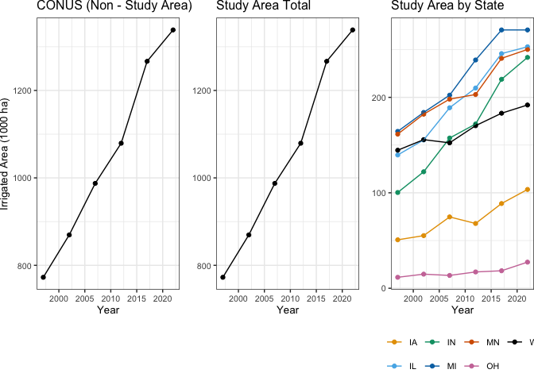
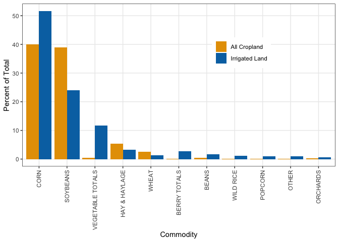

  
Goal: Assess historic changes in irrigated area based on NASS stats

Also includes:

* Generation of Figure 1c
* Generation of Figure 2a
* Calculating statistics for intro and study area background


**R Packages Needed**
  

``` r
library(dplyr)
library(ggplot2)
library(geofacet)
library(tidyr)
library(readr)
library(geofacet)
library(patchwork)
library(viridis)
library(RColorBrewer)

library(here)
sessionInfo()
```

```
## R version 4.5.2 (2025-10-31)
## Platform: aarch64-apple-darwin20
## Running under: macOS Sequoia 15.7.4
## 
## Matrix products: default
## BLAS:   /System/Library/Frameworks/Accelerate.framework/Versions/A/Frameworks/vecLib.framework/Versions/A/libBLAS.dylib 
## LAPACK: /Library/Frameworks/R.framework/Versions/4.5-arm64/Resources/lib/libRlapack.dylib;  LAPACK version 3.12.1
## 
## locale:
## [1] en_US.UTF-8/en_US.UTF-8/en_US.UTF-8/C/en_US.UTF-8/en_US.UTF-8
## 
## time zone: America/Los_Angeles
## tzcode source: internal
## 
## attached base packages:
## [1] stats     graphics  grDevices utils     datasets  methods   base     
## 
## other attached packages:
##  [1] here_1.0.2         RColorBrewer_1.1-3 viridis_0.6.5      viridisLite_0.4.3 
##  [5] patchwork_1.3.2    readr_2.2.0        tidyr_1.3.2        geofacet_0.2.4    
##  [9] ggplot2_4.0.2      dplyr_1.2.0       
## 
## loaded via a namespace (and not attached):
##  [1] rappdirs_0.3.4      sass_0.4.10         generics_0.1.4     
##  [4] class_7.3-23        KernSmooth_2.23-26  lattice_0.22-7     
##  [7] hms_1.1.4           digest_0.6.39       magrittr_2.0.4     
## [10] evaluate_1.0.5      grid_4.5.2          rnaturalearth_1.2.0
## [13] fastmap_1.2.0       rprojroot_2.1.1     jsonlite_2.0.0     
## [16] ggrepel_0.9.8       e1071_1.7-17        DBI_1.2.3          
## [19] gridExtra_2.3       purrr_1.2.1         geogrid_0.1.2      
## [22] scales_1.4.0        httr2_1.2.2         jquerylib_0.1.4    
## [25] cli_3.6.5           rlang_1.1.7         units_1.0-0        
## [28] withr_3.0.2         cachem_1.1.0        yaml_2.3.12        
## [31] tools_4.5.2         tzdb_0.5.0          vctrs_0.7.1        
## [34] R6_2.6.1            proxy_0.4-29        lifecycle_1.0.5    
## [37] classInt_0.4-11     pkgconfig_2.0.3     pillar_1.11.1      
## [40] bslib_0.10.0        gtable_0.3.6        glue_1.8.0         
## [43] Rcpp_1.1.1          sf_1.0-24           xfun_0.56          
## [46] tibble_3.3.1        tidyselect_1.2.1    rstudioapi_0.18.0  
## [49] knitr_1.51          farver_2.1.2        htmltools_0.5.9    
## [52] rmarkdown_2.30      compiler_4.5.2      S7_0.2.1           
## [55] sp_2.2-1
```


*Directories*
  

``` r
# nass data files
repoDir <- here::here()
nassDir <- paste0(repoDir,'/data/tabular/NASS')


nassFileName_raw_irrigated <- 'NASS_Census_IrrArea_CornBeltWide_1997-2022.csv'
nassFileName_raw_cropland <- 'NASS_Census_CroplandArea_CornBeltWide_1997-2022.csv'

# full 2017 census to extract irrigation by crop type
census2017raw_fn <- '/Users/dein121/local/data_nonRepo/2025_quickstats/qs.census2017.txt.gz'

# NASS Census irrigated area BY CROP (compiled in 00.30_checkNASS_irrigationByCrop.Rmd)
compiled_nassIrrDataName <- 'Compiled_CENSUS_2017_irrigated_byCropType_7states.csv'

# for production summary
nassFileName_raw_maize_NAME <- 'NASS_Survey_RAW_Maize_production_yields_harvestedArea_CONUS_1997-2023_20250323.csv'
nassFileName_raw_SOYBEAN_NAME <- 'NASS_Survey_RAW_Soybeans_production_yields_harvestedArea_CONUS_1997-2023_20250323.csv'


# output figures -------------
figDir <- paste0(repoDir,'/Figures_manuscript')
```


# Load 

## national irrigated area 
(from NASS Census via 00.20...Rmd)


``` r
# load county data; also aggregate to state
irr_county <- read_csv(paste0(nassDir,'/',nassFileName_raw_irrigated ))
```

```
## Rows: 16789 Columns: 9
## ── Column specification ────────────────────────────────────────────────────────
## Delimiter: ","
## chr (6): fips5, county_name, state_alpha, state_name, short_desc, domain_desc
## dbl (3): year, irrArea_acres, irrArea_ha
## 
## ℹ Use `spec()` to retrieve the full column specification for this data.
## ℹ Specify the column types or set `show_col_types = FALSE` to quiet this message.
```

``` r
irr_state <- irr_county %>%
  group_by(state_alpha, state_name, year) %>%
  summarize(irrArea_ha = sum(irrArea_ha))
```

```
## `summarise()` has regrouped the output.
## ℹ Summaries were computed grouped by state_alpha, state_name, and year.
## ℹ Output is grouped by state_alpha and state_name.
## ℹ Use `summarise(.groups = "drop_last")` to silence this message.
## ℹ Use `summarise(.by = c(state_alpha, state_name, year))` for per-operation
##   grouping (`?dplyr::dplyr_by`) instead.
```

``` r
#define study area
study_area <- c("MN","WI","IA","IL","IN","MI","OH")

#subset for study area
irr_state_sa <- irr_state[irr_state$state_alpha %in% (study_area),]

#sum irrigated area for the study area states by year
irr_area_sa_year <- irr_state_sa %>%
  group_by(year) %>%
  summarize(irrArea_ha = sum(irrArea_ha))
```

## national cropland area


``` r
#load in cropland dataset
crop_county <- read_csv(paste0(nassDir,'/',nassFileName_raw_cropland))
```

```
## Rows: 18300 Columns: 9
## ── Column specification ────────────────────────────────────────────────────────
## Delimiter: ","
## chr (6): fips5, county_name, state_alpha, state_name, short_desc, domain_desc
## dbl (3): year, croplandArea_ha, croplandArea_acres
## 
## ℹ Use `spec()` to retrieve the full column specification for this data.
## ℹ Specify the column types or set `show_col_types = FALSE` to quiet this message.
```

``` r
#merge dataframes
crop_irr_county <- merge(irr_county, crop_county, by = c("county_name","state_name","year"))

#group to state level
crop_irr_state <- crop_irr_county %>%
  group_by(state_alpha.x, state_name, year) %>%
  summarize(irrArea_ha = sum(irrArea_ha), 
            croplandArea_ha = sum(croplandArea_ha)) %>%
  ungroup()
```

```
## `summarise()` has regrouped the output.
## ℹ Summaries were computed grouped by state_alpha.x, state_name, and year.
## ℹ Output is grouped by state_alpha.x and state_name.
## ℹ Use `summarise(.groups = "drop_last")` to silence this message.
## ℹ Use `summarise(.by = c(state_alpha.x, state_name, year))` for per-operation
##   grouping (`?dplyr::dplyr_by`) instead.
```

``` r
crop_irr_state$irr_percent <- (crop_irr_state$irrArea_ha/crop_irr_state$croplandArea_ha)*100
```

## maize and soy production


``` r
# load NASS
maize_prod00 <- read_csv(paste0(nassDir,'/',nassFileName_raw_maize_NAME))
```

```
## Rows: 176748 Columns: 39
## ── Column specification ────────────────────────────────────────────────────────
## Delimiter: ","
## chr  (28): source_desc, sector_desc, group_desc, commodity_desc, class_desc,...
## dbl   (5): asd_code, country_code, year, Value, CV (%)
## lgl   (5): region_desc, zip_5, watershed_desc, congr_district_code, week_ending
## dttm  (1): load_time
## 
## ℹ Use `spec()` to retrieve the full column specification for this data.
## ℹ Specify the column types or set `show_col_types = FALSE` to quiet this message.
```

``` r
soybeans_prod00 <- read_csv(paste0(nassDir,'/',nassFileName_raw_SOYBEAN_NAME))
```

```
## Rows: 143403 Columns: 39
## ── Column specification ────────────────────────────────────────────────────────
## Delimiter: ","
## chr  (28): source_desc, sector_desc, group_desc, commodity_desc, class_desc,...
## dbl   (5): asd_code, country_code, year, Value, CV (%)
## lgl   (5): region_desc, zip_5, watershed_desc, congr_district_code, week_ending
## dttm  (1): load_time
## 
## ℹ Use `spec()` to retrieve the full column specification for this data.
## ℹ Specify the column types or set `show_col_types = FALSE` to quiet this message.
```

## summarized irr/cropland by crop group
from 00.30...Rmd based on full 2017 census


``` r
irr_byCrop <- read_csv(paste0(nassDir,'/',compiled_nassIrrDataName))
```

```
## Rows: 22 Columns: 5
## ── Column specification ────────────────────────────────────────────────────────
## Delimiter: ","
## chr (3): COMMODITY_DESC, type, type2
## dbl (2): values_ha, percent
## 
## ℹ Use `spec()` to retrieve the full column specification for this data.
## ℹ Specify the column types or set `show_col_types = FALSE` to quiet this message.
```


# MS fig: Fig 1c, trends by states


``` r
palette_OkabeIto <- c("#E69F00", "#56B4E9", "#009E73", "#F0E442", 
                      "#0072B2", "#D55E00", "#CC79A7", "#999999")
palette_OkabeIto_black_newYellow <- c("#E69F00", "#56B4E9", "#009E73", 
                                     # "#F5C710", 
                            "#0072B2", "#D55E00", "#CC79A7", "#000000")

pal_state <- c('#CC6677','#44AA99','#88CCEE','#888888','#AA4499','goldenrod2','#332288')

p_studyArea <- ggplot(irr_state_sa,
       aes(x = year, y = irrArea_ha/1000, group = state_alpha,
           color = state_alpha)) +
  geom_point() + geom_line() +
  #scale_color_viridis(discrete = T, option = 'turbo') +
  scale_color_manual(values = (palette_OkabeIto_black_newYellow)) +
 # facet_wrap(~state_name, nrow = 2) +
  ylab('') +
  theme_bw() + theme(legend.position = 'bottom',
                     legend.title = element_blank()) +
  ggtitle('Study Area by State')

# total study area
p_studyAreaTot <- ggplot(irr_area_sa_year,
       aes(x = year, y = irrArea_ha/1000)) +
  geom_line() + geom_point() +
  ylab('') +
  theme_bw() + ggtitle('Study Area Total')


# rest of conus
p_conus <- ggplot(irr_area_sa_year,
       aes(x = year, y = irrArea_ha/1000)) +
  geom_line() + geom_point() +
  theme_bw() +
   ylab('Irrigated Area (1000 ha)') +
  ggtitle('CONUS (Non - Study Area)')

#combine
p_all <- p_conus + p_studyAreaTot + p_studyArea &
  xlab('Year' )  &
  theme(plot.margin = margin(0, 0, 0, 0, "pt"),
        text = element_text(size = 10))
p_all
```

<!-- -->

``` r
# three wide
ggsave(filename = paste0(figDir,'/Fig1c_NASS_trends_studyAreaTotals_3panel.png'),
       plot =p_all, dpi = 600,
       device = 'png' , width = 6.35, height = 3.15, units = 'in')

ggsave(filename = paste0(figDir,'/Fig1c_NASS_trends_studyAreaTotals_3panel.pdf'),
       plot =p_all, dpi = 600,
       device = 'pdf' , width = 6.35, height = 3.15, units = 'in')
```

# MS fig: Fig 2a, irr by type


``` r
p_areaByCropBoth <- ggplot(irr_byCrop,
      aes(x = reorder(COMMODITY_DESC, -percent), y = percent, fill = type2 )) +
  geom_bar(stat = 'identity', position = 'dodge') +
  xlab('Commodity') + ylab('Percent of Total') +
  theme_bw() +
  scale_fill_manual(values = c('#E69F00','#0072B2')) +
  theme(axis.text.x = element_text(angle = 90, vjust = 0.5, hjust=1),
        legend.title = element_blank(),
        legend.position = c(.7,.7),
        panel.grid.minor.y = element_blank())  
p_areaByCropBoth
```

<!-- -->

``` r
ggsave(filename = paste0(figDir,'/Fig2a_NASS_AreaByCrop_Both.png'),
       plot =p_areaByCropBoth, dpi = 600,
       device = 'png' , width = 3.15, height = 3.5, units = 'in')

ggsave(filename = paste0(figDir,'/Fig2a_NASS_AreaByCrop_Both.pdf'),
       plot =p_areaByCropBoth, dpi = 600,
       device = 'pdf' , width = 3.15, height = 3.5, units = 'in')
```

# MS statistics
## irrigation as a percent of cropped area

Summarize percent of relevant areas


``` r
#define study area
study_area <- c("MN","WI","IA","IL","IN","MI","OH")

crop_irr_state %>%
  filter(state_alpha.x %in% study_area) %>%
  group_by(year) %>%
  summarize(irrArea_ha = sum(irrArea_ha),
            croplandArea_ha = sum(croplandArea_ha)) %>%
  mutate(irr_percent = irrArea_ha/croplandArea_ha*100)
```

```
## # A tibble: 6 × 4
##    year irrArea_ha croplandArea_ha irr_percent
##   <dbl>      <dbl>           <dbl>       <dbl>
## 1  1997    772141.       39074617.        1.98
## 2  2002    869575.       38960078.        2.23
## 3  2007    987382.       39906087.        2.47
## 4  2012   1079227.       41262737.        2.62
## 5  2017   1266645.       40526700.        3.13
## 6  2022   1338402.       40485791.        3.31
```


quantify the increase in irrigated area for the full study region as a whole, as well as by state

compare with regions outside the study area


``` r
#grab irrigated area for years 1997, 2002, 2007, and 2022
irr_area_1997_sa <- irr_area_sa_year$irrArea_ha[irr_area_sa_year$year == 1997]
irr_area_2022_sa <- irr_area_sa_year$irrArea_ha[irr_area_sa_year$year == 2022]

#calculate percent change from 1997-2022
study_area_change_1997 <- ((irr_area_2022_sa - irr_area_1997_sa)/(irr_area_1997_sa))*100 


paste0("From 1997 to 2022, the irrigated area within the study area increased by ", study_area_change_1997, "%.")
```

```
## [1] "From 1997 to 2022, the irrigated area within the study area increased by 73.237899134618%."
```


2) Quantify the change in irrigated area in other regions. (all states within CONUS except the study area)


``` r
#subset contiguous US (without study area)
irr_state_nsa <- irr_state[!(irr_state$state_alpha %in% (study_area) | irr_state$state_alpha %in% c("AK","HI")),]

#sum the irrigated area for the contiguous US without study area, by year
irr_area_nsa_year <- irr_state_nsa %>%
  group_by(year) %>%
  summarize(irrArea_ha = sum(irrArea_ha))

#grab irrigated area for years 2022 and 1997
irr_area_2022_nsa <- irr_area_nsa_year$irrArea_ha[irr_area_nsa_year$year == 2022]
irr_area_1997_nsa <- irr_area_nsa_year$irrArea_ha[irr_area_nsa_year$year == 1997]

#calculate percent change from 1997-2002
non_study_area_change <- ((irr_area_2022_nsa - irr_area_1997_nsa)/(irr_area_1997_nsa))*100 
  
paste0("From 1997 to 2022, the irrigated area within the contiguous US, excluding the study area, increased by ", non_study_area_change, "%.")
```

```
## [1] "From 1997 to 2022, the irrigated area within the contiguous US, excluding the study area, increased by -5.09694712725891%."
```

## production stats

### maize

``` r
#define study area
study_area <- c("MN","WI","IA","IL","IN","MI","OH")

# state production by year
maize_prod0 <- maize_prod00 %>% 
  filter(short_desc == 'CORN, GRAIN - PRODUCTION, MEASURED IN BU') %>%
  dplyr::select(c(state_alpha,year,Value, county_code)) %>%
  group_by(state_alpha, year) %>%
  summarize(production_bu = sum(Value)) %>%
  ungroup()
```

```
## `summarise()` has regrouped the output.
## ℹ Summaries were computed grouped by state_alpha and year.
## ℹ Output is grouped by state_alpha.
## ℹ Use `summarise(.groups = "drop_last")` to silence this message.
## ℹ Use `summarise(.by = c(state_alpha, year))` for per-operation grouping
##   (`?dplyr::dplyr_by`) instead.
```

``` r
# maize study period mean
maize_prod <- maize_prod0 %>%
  filter(year >= 1997 & year <= 2017) %>%
  group_by(state_alpha) %>%
  summarize(production_bu = mean(production_bu))

# percent of maize production in  study area
maize_prod_sums <- maize_prod %>%
  mutate(isStudyArea = case_when(state_alpha %in% study_area ~ 1,
                            !(state_alpha %in% study_area) ~0)) %>%
  group_by(isStudyArea) %>%
  summarize(production_bu = sum(production_bu)) %>%
  tidyr::spread(., key = isStudyArea, value = production_bu) %>%
  mutate(pecentW =  `1` /( `0`+`1`) * 100)
maize_prod_sums
```

```
## # A tibble: 1 × 3
##           `0`         `1` pecentW
##         <dbl>       <dbl>   <dbl>
## 1 4458542605. 7205706886.    61.8
```


### soybeans

``` r
#define study area
study_area <- c("MN","WI","IA","IL","IN","MI","OH")


# state production by year
soybeans_prod0 <- soybeans_prod00 %>% 
  filter(short_desc == 'SOYBEANS - PRODUCTION, MEASURED IN BU') %>%
  dplyr::select(c(state_alpha,year,Value, county_code)) %>%
  group_by(state_alpha, year) %>%
  summarize(production_bu = sum(Value)) %>%
  ungroup()
```

```
## `summarise()` has regrouped the output.
## ℹ Summaries were computed grouped by state_alpha and year.
## ℹ Output is grouped by state_alpha.
## ℹ Use `summarise(.groups = "drop_last")` to silence this message.
## ℹ Use `summarise(.by = c(state_alpha, year))` for per-operation grouping
##   (`?dplyr::dplyr_by`) instead.
```

``` r
# soybeans study period mean
soybeans_prod <- soybeans_prod0 %>%
  filter(year >= 1997 & year <= 2017) %>%
  group_by(state_alpha) %>%
  summarize(production_bu = mean(production_bu))

# percent of soybeans production in  study area
soybeans_prod_sums <- soybeans_prod %>%
  mutate(isStudyArea = case_when(state_alpha %in% study_area ~ 1,
                            !(state_alpha %in% study_area) ~0)) %>%
  group_by(isStudyArea) %>%
  summarize(production_bu = sum(production_bu)) %>%
  tidyr::spread(., key = isStudyArea, value = production_bu) %>%
  mutate(pecentW =  `1` /( `0`+`1`) * 100)
soybeans_prod_sums
```

```
## # A tibble: 1 × 3
##           `0`         `1` pecentW
##         <dbl>       <dbl>   <dbl>
## 1 1314122039. 1858596695.    58.6
```


