  
Goal: Create paper figures displaying yield impacts of irrigation. Also includes deriving some summary statistics


**R Packages Needed**
  

``` r
library(readr)
library(dplyr)
library(ggplot2)
library(RColorBrewer)
library(patchwork)

#library(devtools)
#install_github("vqv/ggbiplot")
library(ggbiplot)

library(here)
sessionInfo()
```

```
## R version 4.5.2 (2025-10-31)
## Platform: aarch64-apple-darwin20
## Running under: macOS Sequoia 15.7.4
## 
## Matrix products: default
## BLAS:   /System/Library/Frameworks/Accelerate.framework/Versions/A/Frameworks/vecLib.framework/Versions/A/libBLAS.dylib 
## LAPACK: /Library/Frameworks/R.framework/Versions/4.5-arm64/Resources/lib/libRlapack.dylib;  LAPACK version 3.12.1
## 
## locale:
## [1] en_US.UTF-8/en_US.UTF-8/en_US.UTF-8/C/en_US.UTF-8/en_US.UTF-8
## 
## time zone: America/Los_Angeles
## tzcode source: internal
## 
## attached base packages:
## [1] stats     graphics  grDevices utils     datasets  methods   base     
## 
## other attached packages:
## [1] here_1.0.2         ggbiplot_0.6.2     patchwork_1.3.2    RColorBrewer_1.1-3
## [5] ggplot2_4.0.2      dplyr_1.2.0        readr_2.2.0       
## 
## loaded via a namespace (and not attached):
##  [1] gtable_0.3.6      jsonlite_2.0.0    compiler_4.5.2    tidyselect_1.2.1 
##  [5] jquerylib_0.1.4   scales_1.4.0      yaml_2.3.12       fastmap_1.2.0    
##  [9] R6_2.6.1          generics_0.1.4    knitr_1.51        tibble_3.3.1     
## [13] rprojroot_2.1.1   bslib_0.10.0      pillar_1.11.1     tzdb_0.5.0       
## [17] rlang_1.1.7       cachem_1.1.0      xfun_0.56         sass_0.4.10      
## [21] S7_0.2.1          cli_3.6.5         withr_3.0.2       magrittr_2.0.4   
## [25] digest_0.6.39     grid_4.5.2        rstudioapi_0.18.0 hms_1.1.4        
## [29] lifecycle_1.0.5   vctrs_0.7.1       evaluate_1.0.5    glue_1.8.0       
## [33] farver_2.1.2      rmarkdown_2.30    tools_4.5.2       pkgconfig_2.0.3  
## [37] htmltools_0.5.9
```


*Directories*
  

``` r
localDir <- '/Users/dein121/local/data_nonRepo/2025_irrigationAndYields/final_data_repo'

# data with results produced vis 03.00 and 03.50 causal forests scripts
dataDir <- paste0(localDir,'/formatted_figureInput')
maize_fn <- 'maize_causalForestOutput_20250206.csv'
soy_fn <- 'soybeans_causalForestOutput_20250206.csv'

# load data
maizeData <- read_csv(paste0(dataDir,'/',maize_fn))
soyData <- read_csv(paste0(dataDir,'/',soy_fn))

# check planting density - maize
repoDir <- here::here()
pd0 <- read_csv(paste0(repoDir,'/data/tabular/nass/plantingDensity_20250212.csv') )

# fig output
figDir <- paste0(repoDir,'/Figures_manuscript')
```

# Fig 4 - yield impacts
## Maize

### Maize Treatment Effects


``` r
# assign groups by cate tercile
maizeData1 <- maizeData %>%
  mutate(cate_group = ntile(predictions,3),
          cate_group = as.factor(cate_group),
         cate_group_p = ntile(yield_diff_perc,3),
         cate_group_p = as.factor(cate_group_p))
table(maizeData1$cate_group)
```

```
## 
##      1      2      3 
## 115812 115812 115812
```

``` r
catePalette3 <- c("#86BDDA","#F6B394","#CF5246")

# plot: t/ha
ate_maize <- 1.53
maizeData1_hte <- maizeData1 %>%
  mutate(cate_class = case_when(cate_group ==1 ~ 'Bottom Tercile',
                                cate_group == 2 ~ 'Mid Tercile',
                                cate_group == 3  ~ 'Top Tercile'))


p_cate_maize <- ggplot(maizeData1_hte,
       aes(x = predictions, fill = cate_class)) +
  geom_histogram(color = 'gray30',
                 breaks = seq(-3,7,.25)) +
  scale_y_continuous(labels = c('0','20','40'),
                     breaks = c(0,20000,40000)) +
  scale_fill_manual(values = c('tan','grey50','turquoise3')) +
  xlab('Yield Impact (t/ha)') + ylab('Thousand Fields') +
  geom_vline(xintercept = 0, col = 'black', linetype = 'dashed') +
  geom_vline(xintercept = ate_maize, col = 'goldenrod2', linewidth = 1.5) +
  theme_bw() + theme(legend.title = element_blank(),
                     legend.position = c(.75,.8))
p_cate_maize
```

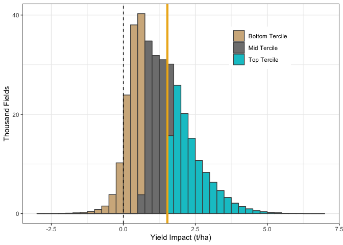<!-- -->

``` r
# plot: percent --------------------------------------
ate_maize_p <- 12.6
maizeData1_hte2 <- maizeData1 %>%
  mutate(cate_class = case_when(cate_group_p ==1 ~ 'Bottom Tercile',
                                cate_group_p == 2 ~ 'Mid Tercile',
                                cate_group_p == 3  ~ 'Top Tercile'))


p_cate_maize_p <- ggplot(maizeData1_hte2,
       aes(x = yield_diff_perc, fill = cate_class)) +
  geom_histogram(color = 'gray30',
                 breaks = seq(-8,40,2)) +
  scale_y_continuous(labels = c('0','10','20','30'),
                     breaks = c(0,10000,20000,30000)) +
  scale_fill_manual(values = c('tan','grey50','turquoise3')) +
  xlab('Yield Impact (% Change)') + ylab('Thousand Fields') +
  geom_vline(xintercept = 0, col = 'black', linetype = 'dashed') +
  geom_vline(xintercept = ate_maize_p, col = 'goldenrod2', linewidth = 1.5) +
  theme_bw() + theme(legend.title = element_blank(),
                     legend.position = c(.75,.8))
p_cate_maize_p
```

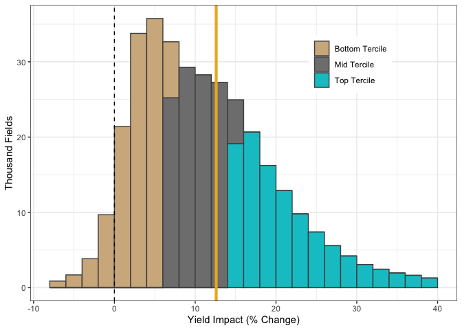<!-- -->

``` r
ggsave(filename = paste0(figDir,'/Fig5a_maize_cf_cateDist_percent.png'),
       plot =p_cate_maize_p, dpi = 600,
       device = 'png' , width = 3.25, height = 3, units = 'in')

ggsave(filename = paste0(figDir,'/Fig5a_maize_cf_cateDist_percent.pdf'),
       plot =p_cate_maize_p, dpi = 600,
       device = 'pdf' , width = 3.25, height = 3, units = 'in')
```

### Maize - PCA


``` r
# run pca
pca_df <- maizeData1 %>% dplyr::select(cate_group,
                                     ksat, nccpicorn, rootznaws,
                                     bulkDensityt,# var imp top 
                                   ppt_jun, tmin_jun, vpd_aug) %>%
  tidyr::drop_na() %>%
  filter(cate_group != 2)

  
pca <- prcomp(pca_df %>% dplyr::select(-cate_group),
                        center = TRUE, scale. = TRUE)
summary(pca)
```

```
## Importance of components:
##                           PC1    PC2    PC3    PC4    PC5     PC6     PC7
## Standard deviation     1.5179 1.0901 0.9913 0.9182 0.8513 0.78874 0.57879
## Proportion of Variance 0.3292 0.1698 0.1404 0.1205 0.1035 0.08887 0.04786
## Cumulative Proportion  0.3292 0.4989 0.6393 0.7597 0.8633 0.95214 1.00000
```

``` r
# rough plot
pcaPal <- c('#bf812d','#5ab4ac')
ggbiplot(pca, groups = as.factor(pca_df$cate_group), alpha=0.02, ellipse=TRUE) +
    scale_color_manual(values = pcaPal) +
  ylab('PCA Component 2') + xlab('PCA Component 1') +
  ylim(c(-3.25,3.25)) + xlim(c(-3, 3)) +
  coord_equal() +
  theme_bw() +theme(legend.position = 'none',
                     panel.grid.major = element_blank(),
                      panel.grid.minor = element_blank(),
                     text = element_text(size = 16))
```

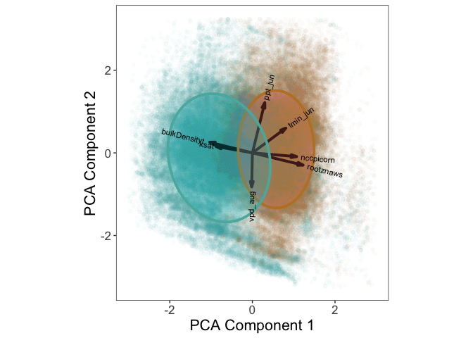<!-- -->

``` r
# create figure in two parts to maintain var name editability (vector) in composite

# # points only
pcaPal <- c('tan3','turquoise4')

p_pcaCloud <- ggbiplot(pca, groups = as.factor(pca_df$cate_group), alpha=0.03, ellipse=FALSE,  var.axes = FALSE) +
    scale_color_manual(values = pcaPal) +
  ylab('PCA Component 2') + xlab('PCA Component 1') +
  ylim(c(-3.25,3.25)) + xlim(c(-3, 3)) +
  coord_equal() +
  theme_bw() +theme(legend.position = 'none',
                     panel.grid.major = element_blank(),
                      panel.grid.minor = element_blank())
p_pcaCloud
```

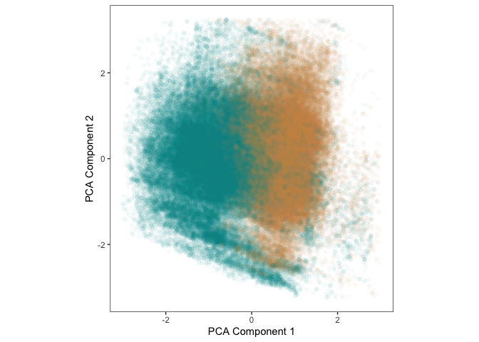<!-- -->

``` r
ggsave(filename = paste0(figDir,'/Fig5b_maize_pca_cloudOnly.png'),
       plot =p_pcaCloud, dpi = 600,
       device = 'png' , width = 7, height = 6, units = 'in')


# # vectors
p_pcaAxes <- ggbiplot(pca, groups = as.factor(pca_df$cate_group), alpha=0.00, ellipse=TRUE) +
    scale_color_manual(values = pcaPal) +
  ylab('PCA Component 2') + xlab('PCA Component 1') +
 ylim(c(-3.25,3.25)) + xlim(c(-3, 3)) +
  coord_equal() +
  theme_bw() +theme(legend.position = 'none',
                     panel.grid.major = element_blank(),
                      panel.grid.minor = element_blank())

p_pcaAxes
```

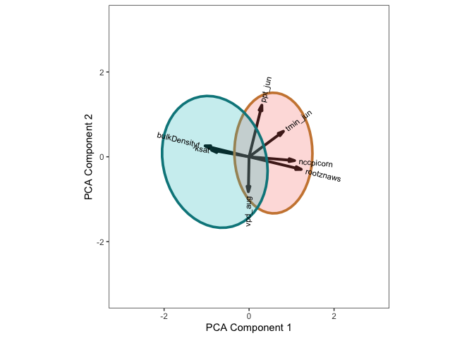<!-- -->

``` r
ggsave(filename = paste0(figDir,'/Fig5b_maize_pca_vectors.pdf'),
       plot =p_pcaAxes, dpi = 600,
       device = 'pdf' , width = 3.5, height = 3, units = 'in')
```


## soybeans

### Soybean Treatment Effects


``` r
# assign groups by cate tercile
soyData1 <- soyData %>%
  mutate(cate_group = ntile(predictions,3),
          cate_group = as.factor(cate_group),
         cate_group_p = ntile(yield_diff_perc,3),
         cate_group_p = as.factor(cate_group_p))
table(soyData1$cate_group)
```

```
## 
##     1     2     3 
## 84905 84904 84904
```

``` r
catePalette3 <- c("#86BDDA","#F6B394","#CF5246")


# plot: t/ha
ate_soy <- 0.29
soyData1_hte <- soyData1 %>%
  mutate(cate_class = case_when(cate_group ==1 ~ 'Bottom Tercile',
                                cate_group == 2 ~ 'Mid Tercile',
                                cate_group == 3  ~ 'Top Tercile'))


p_cate_soy <- ggplot(soyData1_hte,
       aes(x = predictions, fill = cate_class)) +
  geom_histogram(color = 'gray30',
                 breaks = seq(-.3,1,.03)) +
  scale_y_continuous(labels = c('0','10','20'),
                     breaks = c(0,10000,20000)) +
  scale_fill_manual(values = c('tan','grey50','turquoise3')) +
  xlab('Yield Impact (t/ha)') + ylab('Thousand Fields') +
  geom_vline(xintercept = 0, col = 'black', linetype = 'dashed') +
  geom_vline(xintercept = ate_soy, col = 'goldenrod2', linewidth = 1.5) +
  theme_bw() + theme(legend.title = element_blank(),
                     legend.position = c(.75,.8))
p_cate_soy
```

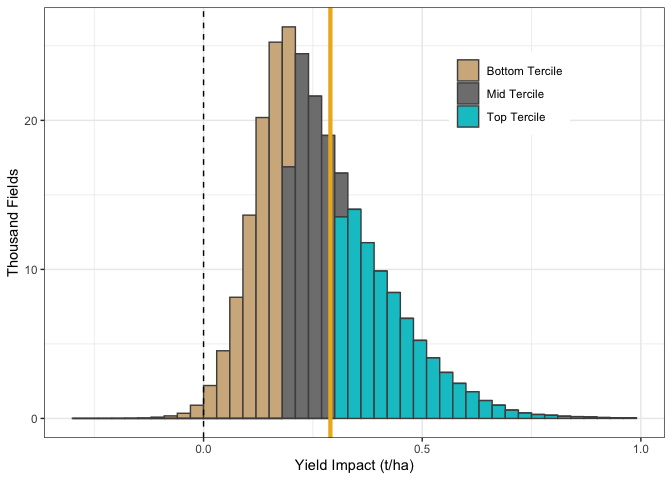<!-- -->

``` r
# plot: percent --------------------------------------
summary(soyData1$yield_diff_perc)
```

```
##    Min. 1st Qu.  Median    Mean 3rd Qu.    Max. 
##  -9.969   4.554   6.829   7.857  10.206  52.811
```

``` r
ate_soy_p <- 7.9
soyData1_hte2 <- soyData1 %>%
  mutate(cate_class = case_when(cate_group_p ==1 ~ 'Bottom Tercile',
                                cate_group_p == 2 ~ 'Mid Tercile',
                                cate_group_p == 3  ~ 'Top Tercile'))


p_cate_soy_p <- ggplot(soyData1_hte2,
       aes(x = yield_diff_perc, fill = cate_class)) +
  geom_histogram(color = 'gray30',
                 breaks = seq(-10,40,2)) +
  scale_y_continuous(labels = c('0','20','40','60'),
                     breaks = c(0,20000,40000,60000)) +
  scale_fill_manual(values = c('tan','grey50','turquoise3')) +
  xlab('Yield Impact (% Change)') + ylab('Thousand Fields') +
  geom_vline(xintercept = 0, col = 'black', linetype = 'dashed') +
  geom_vline(xintercept = ate_soy_p, col = 'goldenrod2', linewidth = 1.5) +
  theme_bw() + theme(legend.title = element_blank(),
                     legend.position = c(.75,.8))
p_cate_soy_p
```

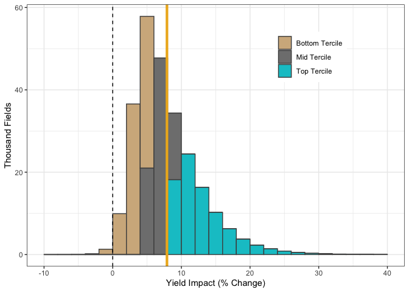<!-- -->

``` r
ggsave(filename = paste0(figDir,'/Fig5c_soy_cf_cateDist_percent.png'),
       plot =p_cate_soy_p, dpi = 600,
       device = 'png' , width = 3.25, height = 3, units = 'in')

ggsave(filename = paste0(figDir,'/Fig5c_soy_cf_cateDist_percent.pdf'),
       plot =p_cate_soy_p, dpi = 600,
       device = 'pdf' , width = 3.25, height = 3, units = 'in')
```


### soybean - PCA


``` r
# assign groups by cate tercile
soyData1 <- soyData %>%
  mutate(cate_group = ntile(predictions,3),
          cate_group = as.factor(cate_group))
table(maizeData1$cate_group)
```

```
## 
##      1      2      3 
## 115812 115812 115812
```

``` r
pca_df_soy <- soyData1 %>% dplyr::select(cate_group,silt,nccpisoy,ksat,
                                         rootznaws, pr_grow, vpd_aug) %>%
  tidyr::drop_na() %>%
  filter(cate_group != 2)

  
pca_soy <- prcomp(pca_df_soy %>% dplyr::select(-cate_group),
                        center = TRUE, scale. = TRUE)
summary(pca_soy)
```

```
## Importance of components:
##                           PC1    PC2    PC3    PC4     PC5     PC6
## Standard deviation     1.5272 1.1876 0.9794 0.7794 0.60274 0.57227
## Proportion of Variance 0.3887 0.2351 0.1599 0.1012 0.06055 0.05458
## Cumulative Proportion  0.3887 0.6238 0.7836 0.8849 0.94542 1.00000
```

``` r
# rough plot
pcaPal <- c('#bf812d','#5ab4ac')
ggbiplot(pca_soy, groups = as.factor(pca_df_soy$cate_group), alpha=0.02, ellipse=TRUE) +
    scale_color_manual(values = pcaPal) +
  ylab('PCA Component 2') + xlab('PCA Component 1') +
 ylim(c(-3.25,3.25)) + xlim(c(-3, 3)) +
  coord_equal() +
  theme_bw() +theme(legend.position = 'none',
                     panel.grid.major = element_blank(),
                      panel.grid.minor = element_blank(),
                     text = element_text(size = 16))
```

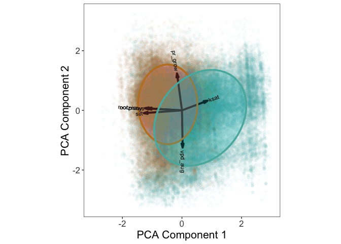<!-- -->

``` r
# create figure in two parts to maintain var name editability (vector) in composite

# # points only
pcaPal <- c('tan3','turquoise4')

p_pcaCloud_soy <- ggbiplot(pca_soy, groups = as.factor(pca_df_soy$cate_group), 
                           alpha=0.03, ellipse=FALSE,  var.axes = FALSE) +
    scale_color_manual(values = pcaPal) +
  ylab('PCA Component 2') + xlab('PCA Component 1') +
 ylim(c(-3.25,3.25)) + xlim(c(-3, 3)) +
  coord_equal() +
  theme_bw() +theme(legend.position = 'none',
                     panel.grid.major = element_blank(),
                      panel.grid.minor = element_blank())
p_pcaCloud_soy
```

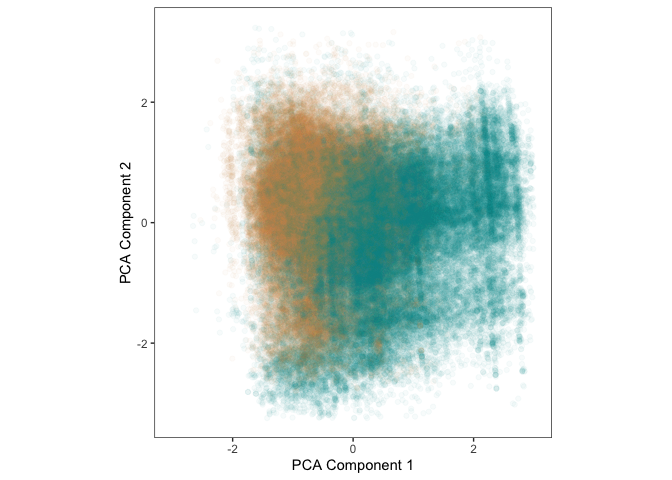<!-- -->

``` r
ggsave(filename = paste0(figDir,'/Fig5d_soy_pca_cloudOnly.png'),
       plot =p_pcaCloud_soy, dpi = 600,
       device = 'png' , width = 7, height = 6, units = 'in')


# # vectors
p_pcaAxes_soy <- ggbiplot(pca_soy, groups = as.factor(pca_df_soy$cate_group), alpha=0.00, ellipse=TRUE) +
    scale_color_manual(values = pcaPal) +
  ylab('PCA Component 2') + xlab('PCA Component 1') +
 ylim(c(-3.25,3.25)) + xlim(c(-3, 3)) +
  coord_equal() +
  theme_bw() +theme(legend.position = 'none',
                     panel.grid.major = element_blank(),
                      panel.grid.minor = element_blank())

p_pcaAxes_soy
```

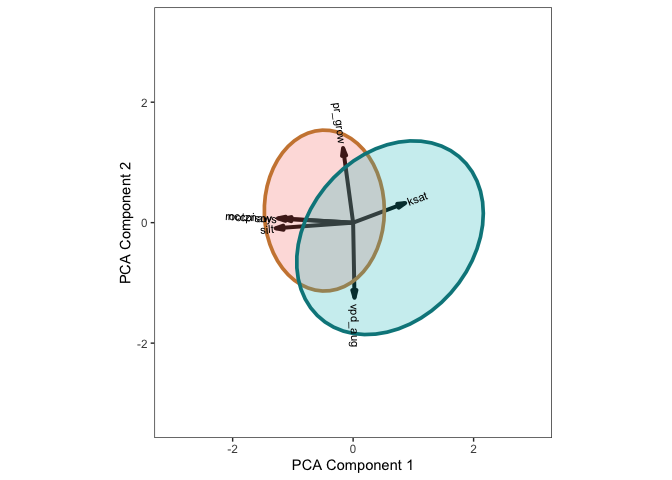<!-- -->

``` r
ggsave(filename = paste0(figDir,'/Fig5d_soy_pca_vectors.pdf'),
       plot =p_pcaAxes_soy, dpi = 600,
       device = 'pdf' , width = 3.5, height = 3, units = 'in')
```


# Fig 6 - trends


## maize + soy over time


``` r
# maize stats: trend in CATE over time
maizeDataAnnualCate <- maizeData %>%
  group_by(year) %>%
  dplyr::summarize(averageP = mean(yield_diff_perc)) %>%
  ungroup()
maizeTrendCATE <- lm(averageP ~ year, data = maizeDataAnnualCate)
summary(maizeTrendCATE)
```

```
## 
## Call:
## lm(formula = averageP ~ year, data = maizeDataAnnualCate)
## 
## Residuals:
##     Min      1Q  Median      3Q     Max 
## -4.2941 -2.2269 -0.7551  0.3255 18.9589 
## 
## Coefficients:
##               Estimate Std. Error t value Pr(>|t|)   
## (Intercept) -1426.1914   426.0911  -3.347  0.00382 **
## year            0.7156     0.2122   3.372  0.00362 **
## ---
## Signif. codes:  0 '***' 0.001 '**' 0.01 '*' 0.05 '.' 0.1 ' ' 1
## 
## Residual standard error: 5.066 on 17 degrees of freedom
## Multiple R-squared:  0.4008,	Adjusted R-squared:  0.3656 
## F-statistic: 11.37 on 1 and 17 DF,  p-value: 0.003619
```

``` r
# summary
earlyObs_maize <- maizeData %>% 
  filter(year >= 1999 & year <=2003) 
summary(earlyObs_maize$yield_diff_perc)
```

```
##    Min. 1st Qu.  Median    Mean 3rd Qu.    Max. 
## -10.778   2.057   4.800   5.756   8.814  38.073
```

``` r
lateObs_maize <- maizeData %>% 
  filter(year >= 2013 & year <=2017) 
summary(lateObs_maize$yield_diff_perc)
```

```
##    Min. 1st Qu.  Median    Mean 3rd Qu.    Max. 
## -81.237   6.412  11.901  13.493  18.378 261.884
```

``` r
# maize plot
p_maize_time <- ggplot(maizeData,
       aes(x =  year, y = yield_diff_perc)) +
  geom_hline(yintercept = 12.6, linetype = 'dashed', color = 'red') +
  geom_hline(yintercept = 0, linetype = 'dotted', color = 'black') +
  geom_boxplot(aes(group = year),outlier.shape = NA, coef=0, fill = 'goldenrod2') +
  coord_cartesian(ylim=c(-2,42)) +
  ylab("Yield Impact (% Change)") + xlab ('Year') +
  theme_bw()  +
  theme(panel.grid.minor.y = element_blank())
p_maize_time
```

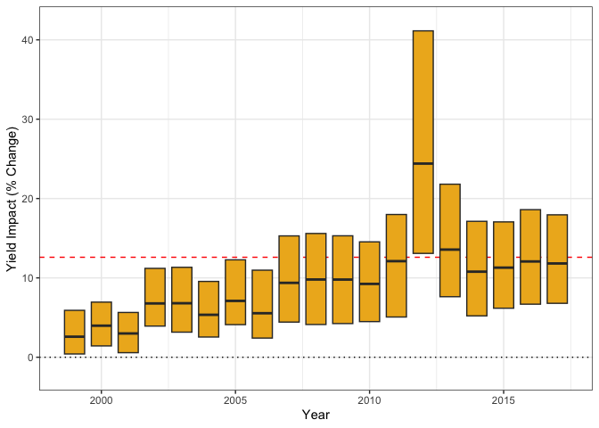<!-- -->

``` r
# soy stats: trend of CATE over time

soyDataAnnualCate <- soyData %>%
  group_by(year) %>%
  dplyr::summarize(averageP = mean(yield_diff_perc)) %>%
  ungroup()
soyTrendCATE <- lm(averageP ~ year, data = soyDataAnnualCate)
summary(soyTrendCATE)
```

```
## 
## Call:
## lm(formula = averageP ~ year, data = soyDataAnnualCate)
## 
## Residuals:
##     Min      1Q  Median      3Q     Max 
## -2.0383 -0.4989 -0.3073  0.6620  3.1103 
## 
## Coefficients:
##               Estimate Std. Error t value Pr(>|t|)    
## (Intercept) -559.03979  100.73056  -5.550 3.53e-05 ***
## year           0.28198    0.05016   5.621 3.05e-05 ***
## ---
## Signif. codes:  0 '***' 0.001 '**' 0.01 '*' 0.05 '.' 0.1 ' ' 1
## 
## Residual standard error: 1.198 on 17 degrees of freedom
## Multiple R-squared:  0.6502,	Adjusted R-squared:  0.6296 
## F-statistic:  31.6 on 1 and 17 DF,  p-value: 3.054e-05
```

``` r
# soy summary
earlyObs_soy <- soyData %>% 
  filter(year >= 1999 & year <=2003) 
summary(earlyObs_soy$yield_diff_perc)
```

```
##    Min. 1st Qu.  Median    Mean 3rd Qu.    Max. 
##  -9.969   3.251   4.954   5.528   7.117  40.268
```

``` r
lateObs_soy <- soyData %>% 
  filter(year >= 2013 & year <=2017) 
summary(lateObs_soy$yield_diff_perc)
```

```
##    Min. 1st Qu.  Median    Mean 3rd Qu.    Max. 
##  -2.004   5.419   7.655   8.688  11.004  48.322
```

``` r
# soy plot
p_soy_time <- ggplot(soyData ,
       aes(x =  year, y = yield_diff_perc)) +
  geom_hline(yintercept = 7.9, linetype = 'dashed', color = 'red') +
  geom_hline(yintercept = 0, linetype = 'dotted', color = 'black') +
  geom_boxplot(aes(group = year),outlier.shape = NA, coef=0, fill = 'green4') +
  coord_cartesian(ylim=c(-2,42)) +
  ylab("Yield Impact (% Change)") + xlab('Year') +
  theme_bw()  +
  theme(panel.grid.minor.y = element_blank())
p_soy_time
```

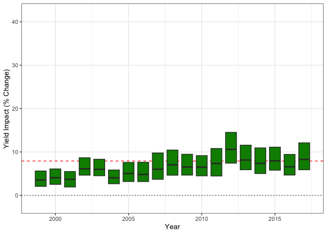<!-- -->

``` r
# combine plots
p_overTime <- p_maize_time + p_soy_time +
  plot_layout(axis_titles = 'collect')
```

## other things over time

planting density downloaded from NASS Quickstats with query: survey - crops - field crops - [corn, soybeans] - [plant population, row width] - state


``` r
# vpd stats: trend
vpdTrend <- lm(vpd_aug ~ year, data = maizeData)
summary(vpdTrend)
```

```
## 
## Call:
## lm(formula = vpd_aug ~ year, data = maizeData)
## 
## Residuals:
##     Min      1Q  Median      3Q     Max 
## -0.7226 -0.2640 -0.1161  0.1215  1.4353 
## 
## Coefficients:
##               Estimate Std. Error t value Pr(>|t|)    
## (Intercept) -1.633e+01  2.877e-01  -56.77   <2e-16 ***
## year         8.639e-03  1.431e-04   60.38   <2e-16 ***
## ---
## Signif. codes:  0 '***' 0.001 '**' 0.01 '*' 0.05 '.' 0.1 ' ' 1
## 
## Residual standard error: 0.3807 on 347434 degrees of freedom
## Multiple R-squared:  0.01038,	Adjusted R-squared:  0.01038 
## F-statistic:  3646 on 1 and 347434 DF,  p-value: < 2.2e-16
```

``` r
summary(maizeData$vpd_aug)
```

```
##    Min. 1st Qu.  Median    Mean 3rd Qu.    Max. 
##  0.3624  0.7725  0.9049  1.0394  1.1567  2.4858
```

``` r
p_augvpd <- ggplot(maizeData,
       aes(x =  year, y = vpd_aug)) +
    geom_hline(yintercept = 0.9, linetype = 'dashed', color = 'red') +
  geom_boxplot(aes(group = year),outlier.shape = NA, coef=0, fill = 'cadetblue3') +
  coord_cartesian(ylim= c(.45,2))+

  ylab("August VPD (kPa)") + xlab('Year')+
  theme_bw()  +
  theme(panel.grid.minor = element_blank())
p_augvpd
```

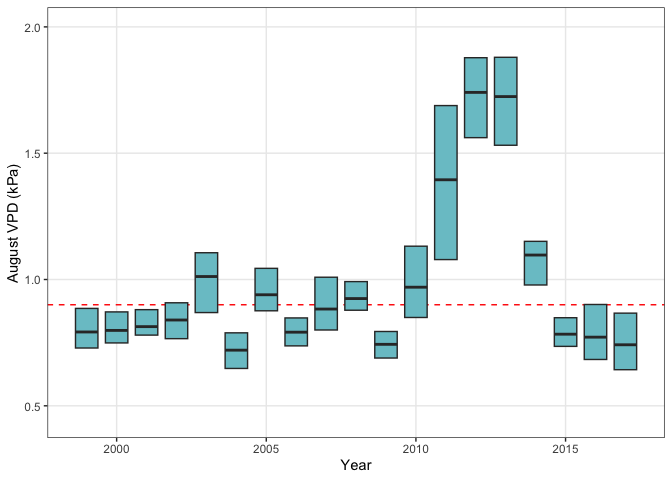<!-- -->

``` r
# maize planting dates: format and plot
pd <- pd0 %>%
  mutate(Value = gsub(",","",Value)) %>%
  mutate(Value = as.numeric(Value)) %>%# just 1 na %
  mutate(dataItem = `Data Item`)

# by state
plantDensity <- pd %>%
  filter(State %in% c('ILLINOIS','INDIANA','IOWA','MINNESOTA','OHIO',
                      'WISCONSIN'),
         Period == 'YEAR') %>%
  dplyr::group_by(Year, State) %>%
  dplyr::summarize(Value = mean(Value))

ggplot(plantDensity,
       aes(x = Year, y = Value, color = State, group = State)) +
  geom_line() +
  ylab('Planting Density') +
  #facet_wrap(~State) +
  theme_bw() +
  theme(legend.position = 'bottom')
```

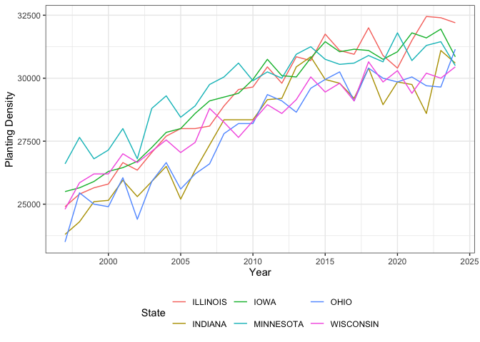<!-- -->

``` r
# region average
plantDensity_studyArea <- pd %>%
  filter(State %in% c('ILLINOIS','INDIANA','IOWA','MINNESOTA','OHIO',
                      'WISCONSIN'),
         Period == 'YEAR') %>%
  dplyr::group_by(Year) %>%
  dplyr::summarize(Value = mean(Value))

p_plantDens <- ggplot(plantDensity_studyArea %>% filter(Year < 2018 & Year >=1997),
       aes(x = Year, y = Value/1000)) +
  geom_line() +
  ylab('Thousand Plants Per Acre') +
  #facet_wrap(~State) +
  theme_bw()  +
  theme(panel.grid.minor = element_blank())
p_plantDens
```

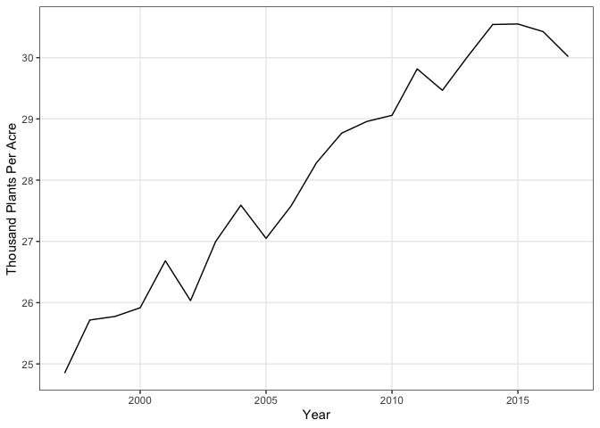<!-- -->


## combine fig 7


``` r
design <- "AABB
           CCDD"

p_fig4_top <- p_maize_time + p_soy_time + p_augvpd +p_plantDens +
  plot_layout(axis_titles = 'collect',
              design = design)
p_fig4_top
```

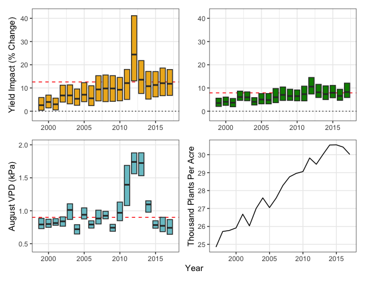<!-- -->

``` r
ggsave(filename = paste0(figDir,'/Fig7_part_abcd.pdf'),
       plot =p_fig4_top, dpi = 600,
       device = 'pdf' , width = 6.75, height = 5, units = 'in')

ggsave(filename = paste0(figDir,'/Fig7_part_abcd.png'),
       plot =p_fig4_top, dpi = 600,
       device = 'png' , width = 6.75, height = 5, units = 'in')
```


# Fig 6 - By Soil Quality and VPD
text numbers and fig


``` r
both <- maizeData %>%
  mutate(crop = 'Maize') %>%
  dplyr::select(c(geom_id, year, crop, predictions, Y,
                  yield_diff_perc, vpd_aug)) %>%
  bind_rows(soyData %>%
              mutate(crop = 'Soybeans') %>%
              dplyr::select(c(geom_id, year, crop, predictions, Y, 
                              yield_diff_perc, vpd_aug))) %>%
  mutate(vpd_bin = case_when(vpd_aug > 0.5 & vpd_aug <= 1 ~ 0.5,
                             vpd_aug > 1 & vpd_aug <= 1.5 ~ 1,
                             vpd_aug > 1.5 & vpd_aug <= 2 ~ 1.5,
                             vpd_aug > 2 & vpd_aug <= 2.5 ~2)) %>%
  mutate(vpd_bin_crop = interaction(vpd_bin, crop),
         vpd_bin_crop2 = factor(vpd_bin_crop,
                                  levels = c('0.5.Soybeans','0.5.Maize',
                                             '1.Soybeans',  '1.Maize',
                                             '1.5.Soybeans','1.5.Maize',
                                             '2.Soybeans',  '2.Maize')))
# stats by class
stats <-both %>%
  dplyr::group_by(crop, vpd_bin) %>%
  dplyr::summarize(yield_diff_perc2 = mean(yield_diff_perc),
                   CATE = mean(predictions),
            vpd_aug = mean(vpd_aug, na.rm = T)) 

stats
```

```
## # A tibble: 10 × 5
## # Groups:   crop [2]
##    crop     vpd_bin yield_diff_perc2  CATE vpd_aug
##    <chr>      <dbl>            <dbl> <dbl>   <dbl>
##  1 Maize        0.5            10.8  1.25    0.798
##  2 Maize        1              11.6  1.21    1.17 
##  3 Maize        1.5            19.1  1.53    1.74 
##  4 Maize        2              32.2  1.38    2.12 
##  5 Maize       NA              12.1  1.56    0.471
##  6 Soybeans     0.5             7.39 0.254   0.799
##  7 Soybeans     1               8.16 0.273   1.16 
##  8 Soybeans     1.5             9.37 0.300   1.74 
##  9 Soybeans     2              10.1  0.329   2.12 
## 10 Soybeans    NA               6.33 0.230   0.469
```

``` r
# boxplot - with modified labels to show bins
p_vpdYield <- ggplot(both %>% filter(!is.na(vpd_bin)),
                     aes(x = vpd_bin, y = yield_diff_perc, fill = crop,
                         group = vpd_bin_crop2)) +
  geom_boxplot(outlier.shape = NA, coef=0, ) +
  geom_point(data = stats, aes(x = vpd_bin, y = yield_diff_perc2, 
                               group=interaction(crop, vpd_bin)),
             shape = 'asterisk') +
  scale_x_continuous(breaks = c(0.25,    .75,1.25,1.75,2.25),
                     labels = c('0.5','1','1.5','2','2.5')) +
  scale_fill_manual(values = c('goldenrod2','green4')) +
  coord_cartesian(ylim=c(0,40)) +
  
  ylab('Yield Impact (% Change)') + xlab('August VPD (kPa)') +
  theme_bw() + theme(legend.title = element_blank(),
                     legend.position = c(.3,.8),
                     legend.background = element_blank(),
                     panel.grid.minor = element_blank())

p_vpdYield
```

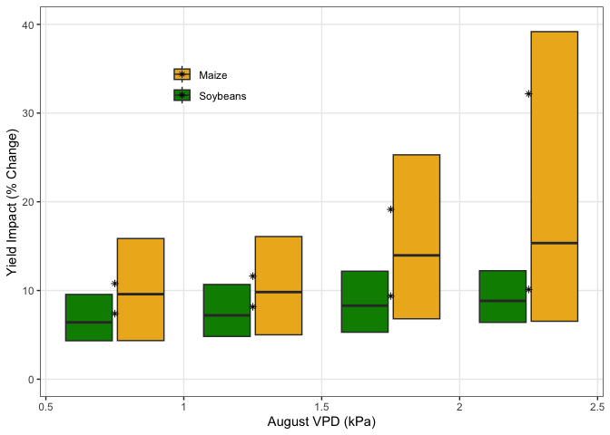<!-- -->

``` r
# get some summary stats - vpd occurence, historical
vpdCounts <- both %>%
  mutate(vpd_bin = case_when(is.na(vpd_bin) ~ 0.5,
                             !is.na(vpd_bin) ~ vpd_bin)) %>%
  group_by(vpd_bin) %>%
  dplyr::summarize(number = n()) %>% 
  ungroup()
vpd_n = sum(vpdCounts$number)
vpdCounts2 <- vpdCounts %>% mutate(percent = number/vpd_n * 100)
vpdCounts2
```

```
## # A tibble: 4 × 3
##   vpd_bin number percent
##     <dbl>  <int>   <dbl>
## 1     0.5 372009   61.8 
## 2     1   139956   23.2 
## 3     1.5  77791   12.9 
## 4     2    12393    2.06
```

## soil and yields

### line plot - not used


``` r
# maize yield affects of top/bottom quartiles
maizeData %>%
  mutate(nccpi_tile = ntile(nccpicorn,4)) %>%
  dplyr::group_by(nccpi_tile) %>%
  dplyr::summarize(yield_diff_perc2 = mean(yield_diff_perc),
            nccpi = mean(nccpicorn))
```

```
## # A tibble: 4 × 3
##   nccpi_tile yield_diff_perc2 nccpi
##        <int>            <dbl> <dbl>
## 1          1            20.3  0.380
## 2          2            13.6  0.585
## 3          3            10.0  0.712
## 4          4             6.44 0.863
```

``` r
quantile(maizeData$nccpicorn,.05)
```

```
##    5% 
## 0.298
```

``` r
# soy yield affects of top/bottom quartiles
soyData %>%
  mutate(nccpi_tile = ntile(nccpisoy,4)) %>%
  dplyr::group_by(nccpi_tile) %>%
  dplyr::summarize(yield_diff_perc2 = mean(yield_diff_perc),
            nccpi = mean(nccpisoy))
```

```
## # A tibble: 5 × 3
##   nccpi_tile yield_diff_perc2  nccpi
##        <int>            <dbl>  <dbl>
## 1          1            11.1   0.351
## 2          2             8.48  0.556
## 3          3             6.48  0.699
## 4          4             5.34  0.820
## 5         NA            16.5  NA
```

``` r
# figure (supplement)
p_maizeSoil <- ggplot(maizeData %>% filter(nccpicorn > 0.2),
                      aes(x =  nccpicorn, y = yield_diff_perc)) +
   geom_smooth(col = 'goldenrod2') +
  coord_cartesian(ylim=c(0,25)) +
  ylab('Yield Impact (% Change)') + xlab('Soil Productivity Index') +
  theme_bw() + ggtitle('Maize') +
  theme(panel.grid.minor = element_blank())

p_soySoil <- ggplot(soyData %>% filter(nccpisoy > 0.2),
                      aes(x =  nccpisoy, y = yield_diff_perc)) +
   coord_cartesian(ylim=c(0,25)) +
   geom_smooth(col = 'green4') +
  ylab('Yield Impact (% Change)') + xlab('Soil Productivity Index') +
  theme_bw() + ggtitle('Soybeans') +
  theme(panel.grid.minor = element_blank())

# combine
p_soils <- p_maizeSoil + p_soySoil +
  plot_layout(axis_titles = 'collect')
p_soils
```

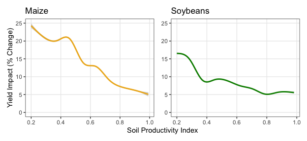<!-- -->


### soil by bins


``` r
# combine crop dfs with soil quartiles
both_soilBins <- maizeData %>%
  mutate(crop = 'Maize',
         nccpi_tile = ntile(nccpicorn,4)) %>%
  dplyr::select(c(geom_id, crop, W, predictions, yield_diff_perc, nccpi_tile)) %>%
  bind_rows(soyData %>%
              mutate(crop = 'Soybeans',
                     nccpi_tile = ntile(nccpisoy,4)) %>%
              dplyr::select(c(geom_id, crop, W, predictions,
                              yield_diff_perc, nccpi_tile))) 


# stats by class
stats_soil <-both_soilBins %>%
  dplyr::group_by(crop, nccpi_tile) %>%
  dplyr::summarize(yield_diff_perc2 = mean(yield_diff_perc),
                   CATE = mean(predictions)) 

stats_soil
```

```
## # A tibble: 9 × 4
## # Groups:   crop [2]
##   crop     nccpi_tile yield_diff_perc2  CATE
##   <chr>         <int>            <dbl> <dbl>
## 1 Maize             1            20.3  2.07 
## 2 Maize             2            13.6  1.38 
## 3 Maize             3            10.0  1.04 
## 4 Maize             4             6.44 0.632
## 5 Soybeans          1            11.1  0.362
## 6 Soybeans          2             8.48 0.287
## 7 Soybeans          3             6.48 0.223
## 8 Soybeans          4             5.34 0.190
## 9 Soybeans         NA            16.5  0.463
```

``` r
# plot
p_soilYield <- ggplot(both_soilBins %>% filter(!is.na(nccpi_tile)),
                     aes(x = nccpi_tile, y = yield_diff_perc, fill = crop,
                         group = interaction(crop,nccpi_tile))) +
  geom_boxplot(outlier.shape = NA, coef=0, ) +
  geom_point(data = stats_soil, aes(x = nccpi_tile, y = yield_diff_perc2, 
                               group=interaction(crop, nccpi_tile)),
             shape = 'asterisk') +
  scale_fill_manual(values = c('goldenrod2','green4')) +
  coord_cartesian(ylim=c(0,40)) +
  ylab('Yield Impact (% Change)') + xlab('Soil Quality Quartile') +
  theme_bw() + theme(legend.title = element_blank(),
                     legend.position = c(.3,.8),
                     legend.background = element_blank(),
                     panel.grid.minor = element_blank())

p_soilYield
```

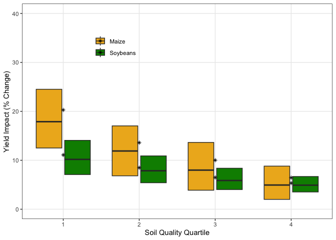<!-- -->

### combine vpd and soils


``` r
p_vpdYield2 <- p_vpdYield + ylab('') + theme(legend.position = 'none')

p_soyVpd <- p_soilYield + p_vpdYield2


ggsave(filename = paste0(figDir,'/Fig6_effects_bySoil_byVpd.png'),
       plot =p_soyVpd, dpi = 600,
       device = 'png' , width = 6.5, height = 3, units = 'in')    

ggsave(filename = paste0(figDir,'/Fig6_effects_bySoil_byVpd.pdf'),
       plot =p_soyVpd, dpi = 600,
       device = 'pdf' , width = 6.5, height = 3, units = 'in')   
```


# By State
supplement

``` r
states <- data.frame(state_name = 
                       c('Illinois','Indiana','Iowa','Michigan','Minnesota',
                         'Ohio','Wisconsin'),
                     state_abbrev = c('IL','IN','IA','MI','MN','OH','WI'),
                     stringsAsFactors = FALSE)


maizeStates <- maizeData1 %>% 
  filter(state_name %in% states$state_name) %>% 
  left_join(states)
soyStates <- soyData1 %>% 
    filter(state_name %in% states$state_name) %>% 
  left_join(states)


maizeStates_cate <- maizeStates %>%
  dplyr::group_by(state_abbrev) %>%
  dplyr::summarize(yield_diff_perc = mean(yield_diff_perc)) %>%
  ungroup()

maizeStates %>% 
  filter(state_abbrev %in% c('IA','IL','IN')) %>%
  dplyr::summarise(cate = mean(yield_diff_perc),
                   cate2 = mean(predictions))
```

```
## # A tibble: 1 × 2
##    cate cate2
##   <dbl> <dbl>
## 1  9.04 0.835
```

``` r
soyStates_cate <- soyStates %>%
  dplyr::group_by(state_abbrev) %>%
  dplyr::summarize(yield_diff_perc = mean(yield_diff_perc)) %>%
  ungroup()

soyStates %>% 
  filter(state_abbrev %in% c('IA','IL','IN')) %>%
  dplyr::summarise(cate = mean(yield_diff_perc),
                   cate2 = mean(predictions))
```

```
## # A tibble: 1 × 2
##    cate cate2
##   <dbl> <dbl>
## 1  6.39 0.222
```

``` r
# ATE as percent
p_stateMaizePercent <- ggplot(maizeStates,
       aes(x = state_abbrev, y = yield_diff_perc, group = state_abbrev)) +
  geom_boxplot(outlier.shape = NA, coef=0) +
  # geom_point(data = maizeStates_cate, aes(x = state_abbrev, y =yield_diff_perc ),
  #            shape = 'asterisk') +
  coord_cartesian(ylim=c(-2,25)) +
  ylab("Yield Change (%)") + xlab('State') +
  theme_bw()  +
  theme(panel.grid.minor.y = element_blank())

p_stateSoyPercent <- ggplot(soyStates,
       aes(x = state_abbrev, y = yield_diff_perc, group = state_abbrev)) +
  geom_boxplot(outlier.shape = NA, coef=0) +
    # geom_point(data = soyStates_cate, aes(x = state_abbrev, y =yield_diff_perc ),
    #          shape = 'asterisk') +
  coord_cartesian(ylim=c(-2,25)) +
  ylab("Yield Change (%)") + xlab('State') +
  theme_bw()  +
  theme(panel.grid.minor.y = element_blank())

p_stateMaizePercent + p_stateSoyPercent
```

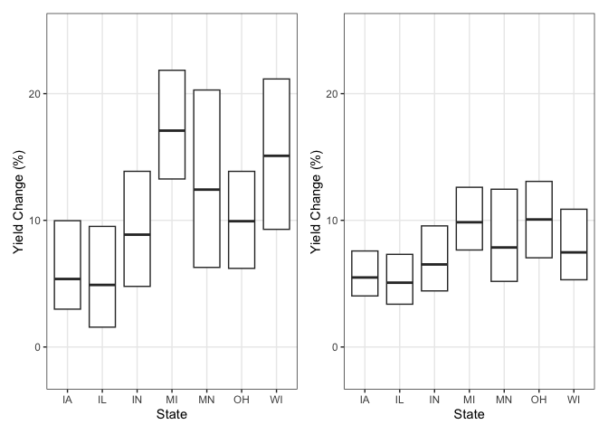<!-- -->

``` r
# ate as raw yield
p_stateMaize <- ggplot(maizeStates,
       aes(x = state_abbrev, y = predictions, group = state_name)) +
  geom_boxplot(outlier.shape = NA, coef=0) +
  coord_cartesian(ylim=c(0,3)) +
  ylab("Yield Impact (t/ha)") + xlab('State') +
  theme_bw()  +
  theme(panel.grid.minor.y = element_blank())

p_stateSoy <- ggplot(soyStates,
       aes(x = state_abbrev, y = predictions, group = state_name)) +
  geom_boxplot(outlier.shape = NA, coef=0) +
  coord_cartesian(ylim=c(0,.75)) +
  ylab("Yield Impact (t/ha)") + xlab('State') +
  theme_bw()  +
  theme(panel.grid.minor.y = element_blank())

p_stateMaize + p_stateSoy
```

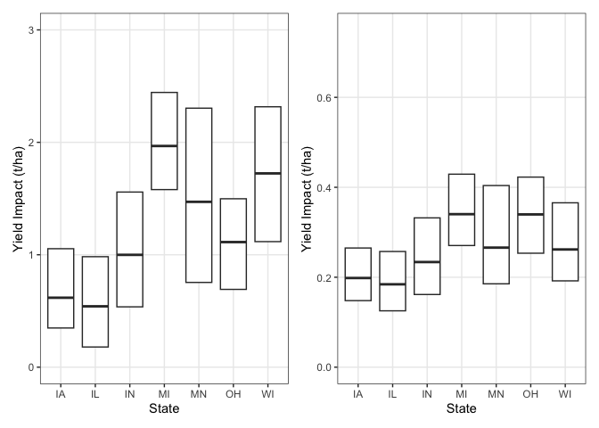<!-- -->

``` r
# covars by state
p_stateNCCPI <- ggplot(maizeStates,
       aes(x = state_abbrev, y = ksat, group = state_name)) +
  geom_boxplot(outlier.shape = NA, coef=0) +
  coord_cartesian(ylim=c(.25,1)) +
  ylab("Soil Productivity Index") + xlab('State') +
  theme_bw()  +
  theme(panel.grid.minor.y = element_blank())

p_ppt <- ggplot(soyStates,
       aes(x = state_abbrev, y = pr_grow, group = state_name)) +
  geom_boxplot(outlier.shape = NA, coef=0) +
  coord_cartesian(ylim=c(250,650)) +
  ylab("Jun-Aug Precip. (mm)") + xlab('State') +
  theme_bw()  +
  theme(panel.grid.minor.y = element_blank())

p_vpd <- ggplot(soyStates,
       aes(x = state_abbrev, y = vpd_aug, group = state_name)) +
  geom_boxplot(outlier.shape = NA, coef=0) +
  coord_cartesian(ylim=c(0.25,1.75)) +
  ylab("August VPD (hPa)") + xlab('State') +
  theme_bw()  +
  theme(panel.grid.minor.y = element_blank())

p_wtd <- ggplot(soyStates,
       aes(x = state_abbrev, y = wtd_zell, group = state_name)) +
  geom_boxplot(outlier.shape = NA, coef=0) +
  coord_cartesian(ylim=c(-0.50,10)) +
  ylab("Water Table Depth (m)") + xlab('State') +
  theme_bw()  +
  theme(panel.grid.minor.y = element_blank())


# compose figure
p_stateSplit <- (p_stateMaizePercent + p_stateSoyPercent) / 
  (p_stateMaize + p_stateSoy) +
  (p_stateNCCPI  + p_ppt ) /
  (p_vpd  + p_wtd)  &
  xlab(NULL)
p_stateSplit
```

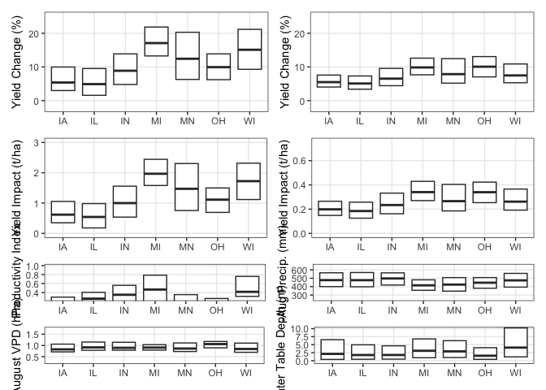<!-- -->

``` r
ggsave(filename = paste0(figDir,'/FigS_effects_byState_withVars.png'),
       plot =p_stateSplit, dpi = 600,
       device = 'png' , width = 6.5, height = 6, units = 'in')    

ggsave(filename = paste0(figDir,'/Figs_effects_byState_withVars.pdf'),
       plot =p_stateSplit, dpi = 600,
       device = 'pdf' , width = 6.5, height = 6, units = 'in') 
```

